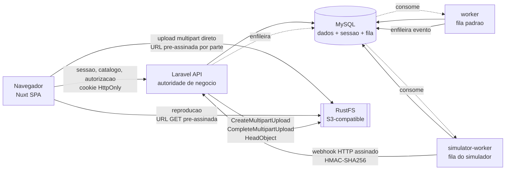
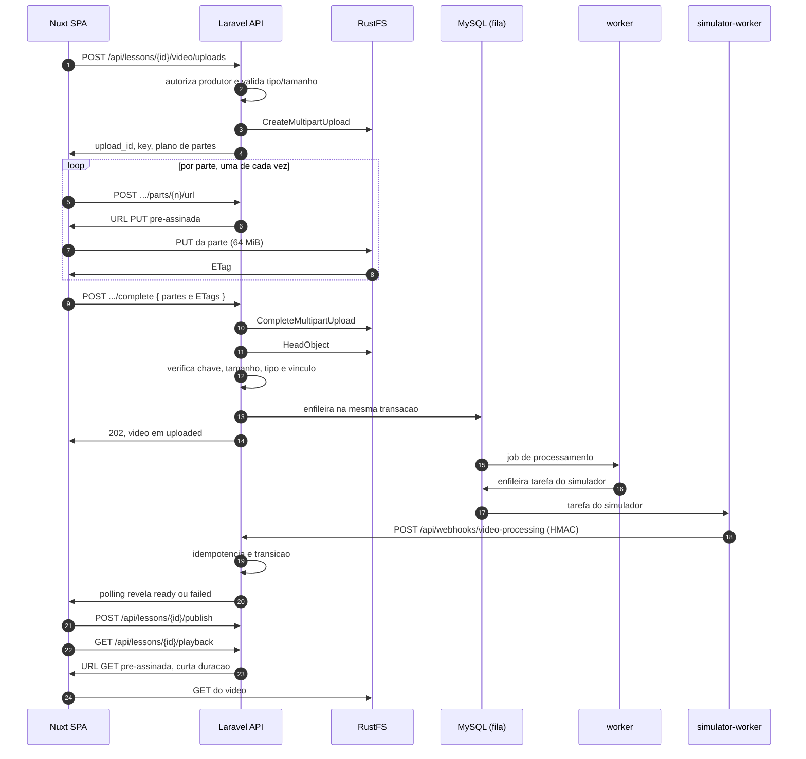

# Plano Técnico e Arquitetural — Plataforma de Conteúdo em Vídeo

**Feature:** 001-video-platform
**Estado:** aprovado. Liberado para implementação conforme `tasks.md`. Alteração
arquitetural posterior continua exigindo revisão e aprovação antes de ser
implementada
**Escopo deste documento:** como a solução atenderá à `spec.md` e ao desafio

---

## 1. Objetivo, escopo e fontes

Este documento descreve **como** a solução será construída. O **que** ela faz e
sob quais regras está em `spec.md` e não é redefinido aqui.

O plano existe para eliminar decisões durante a implementação. Cada escolha
abaixo é concreta o suficiente para que uma tarefa derivada dela não precise
voltar a decidir. Nenhuma decisão técnica permanece pendente neste plano. Se uma
nova decisão arquitetural surgir durante a decomposição ou a implementação, ela
deverá ser registrada, analisada e aprovada explicitamente antes de alterar o
plano ou o código — nunca resolvida em silêncio dentro de uma tarefa.

### 1.1 Fontes

| Fonte | Papel |
| --- | --- |
| Desafio técnico da empresa | Requisitos obrigatórios e restrições inegociáveis |
| `spec.md` | Comportamento funcional aprovado, com identificadores RF, RN, AC, RNF e ABERTO |
| Este documento | Decisões técnicas do projeto, com justificativa e trade-off |

### 1.2 Fora do escopo deste documento

Código, arquivos de configuração, `docker-compose.yml`, migrations e a
decomposição em tarefas. O `tasks.md` derivará deste plano.

---

## 2. Requisitos obrigatórios versus decisões do projeto

A distinção importa porque uma escolha nossa precisa ser defendida por
necessidade e trade-off, enquanto um requisito da empresa não admite substituição
por preferência arquitetural. Depois de aprovada, porém, uma decisão do projeto
vira compromisso de implementação com o mesmo peso.

| Área | Imposto pelo desafio | Decidido pelo projeto |
| --- | --- | --- |
| Backend | PHP 8.4/8.5, Laravel 13, API REST/JSON, DDD, Arquitetura Hexagonal | Divisão em quatro camadas e três áreas, portas específicas, domínio em PHP puro |
| Frontend | Nuxt 4, Vue 3, TypeScript, Composition API, consumo real da API | SPA com `ssr: false`, `useState` restrito, Nuxt UI v4 com Tailwind CSS 4 |
| Dados | MySQL 8, migrations, dados de avaliação | MySQL também como store de sessão e de fila |
| Autenticação | Autenticar perfis, autorizar no backend, não expor segredos no cliente, tratar CORS e CSRF | Laravel Sanctum em modo SPA, sessão em cookie HttpOnly |
| Vídeo | Transferência fora da requisição convencional, conclusão verificada, processamento assíncrono, callback idempotente | RustFS S3-compatible, multipart direto do browser, `HeadObject`, HMAC-SHA256 |
| Fila | Não bloquear a requisição HTTP | Laravel Database Queue sobre MySQL, sem Redis |
| Ambiente | Ambiente reproduzível ou público | Docker Compose |
| Qualidade | Testes nas duas camadas, jornada integrada, pipeline com build | PHPUnit, Pint, Vitest, ESLint, Playwright |

Nenhuma tecnologia da coluna da direita é exigência da empresa. Sanctum, RustFS,
multipart, Database Queue, Nuxt UI, Docker Compose, HMAC e Problem Details são
escolhas deste projeto, adotadas dentro da liberdade que o desafio concede.

Os itens `ABERTO-001` a `ABERTO-014` da `spec.md` pertencem à coluna da direita.
Foram criados justamente para serem decididos aqui. A seção 20 mapeia cada um.

---

## 3. Visão geral da arquitetura

Monólito modular: uma aplicação Laravel como autoridade de negócio e autorização,
uma SPA Nuxt como cliente, MySQL para persistência, sessão e fila, e um storage
de objetos compatível com S3 para os vídeos. Os bytes do vídeo nunca atravessam
Laravel nem o servidor Nuxt.



Três propriedades sustentam o desenho:

**A API decide, o storage transporta.** O Laravel autoriza, cria o upload,
verifica o objeto e emite credenciais temporárias. Os gigabytes trafegam entre
navegador e storage, atendendo RNF-001 sem transformar a aplicação em proxy.

**O trabalho assíncrono sai da requisição.** O `worker` consome a fila e delega ao
simulador; a requisição HTTP que dispara o processamento retorna imediatamente,
atendendo RF-PROC-002 e RNF-002.

**O simulador entra pela porta da frente.** O `simulator-worker` não escreve nas
tabelas de domínio: ele chama o webhook HTTP real, assinado, exercitando
autenticação de origem, idempotência e transições exatamente como um provedor
externo faria. É o que torna RF-PROC-003 verdadeiro em vez de decorativo.

---

## 4. Componentes e fluxo

### 4.1 Componentes

| Componente | Responsabilidade | Origem |
| --- | --- | --- |
| Nuxt SPA | Interface das duas jornadas, estados de tela, transferência multipart | Desafio (Nuxt 4) + projeto (SPA) |
| Laravel API | Regras, autorização, contratos, criação e verificação de upload, webhook | Desafio (Laravel 13) |
| MySQL | Dados de domínio, sessões, fila e falhas de job | Desafio (MySQL 8) + projeto (sessão e fila) |
| RustFS | Objetos de vídeo, multipart, URLs pré-assinadas | Projeto |
| worker | Consome a fila padrão e delega o processamento | Projeto |
| simulator-worker | Representa o provedor externo e chama o webhook | Projeto |
| setup | Prepara banco, bucket e dados de avaliação na subida | Projeto |

### 4.2 Fluxo principal, do envio à reprodução



O `worker` delega em vez de processar porque o processamento pertence
conceitualmente a um serviço externo. Essa indireção é o que permite trocar o
`simulator-worker` por um provedor real sem tocar no domínio.

---

## 5. Organização DDD e Hexagonal do backend

DDD e Arquitetura Hexagonal são exigência do desafio. A forma pragmática abaixo é
decisão do projeto: quatro camadas, três áreas de capacidade, portas específicas
ao problema. Sem CQRS, sem event sourcing, sem repositório genérico, sem
microserviços — nenhum deles traria benefício neste escopo, e o próprio desafio
afirma que complexidade sem necessidade não é diferencial.

### 5.1 Camadas

| Camada | Contém | Pode depender de |
| --- | --- | --- |
| `Domain` | Entidades, agregados, value objects, invariantes, erros de domínio | Nada além de PHP |
| `Application` | Casos de uso, portas, orquestração e limite transacional | `Domain` |
| `Infrastructure` | Eloquent, storage S3, fila, HMAC, relógio, adapters | `Domain`, `Application` |
| `Interfaces` | Controllers HTTP, Form Requests, Resources, middleware, rotas | `Application` |

A regra de dependência aponta sempre para dentro. `Domain` é PHP puro: não
importa Eloquent, não importa facades, não conhece HTTP. É o que torna as regras
testáveis sem framework e satisfaz RNF-004.

### 5.2 Áreas

```
app/
    Identity/           autenticacao, perfis, concessao de acesso
    Catalog/            curso, modulo, aula, estrutura, publicacao
    Video/              tentativa de envio, ciclo de vida, webhook, reproducao
    Shared/             tipos e utilitarios comuns as tres areas
```

Cada área repete as quatro camadas:

```
app/Catalog/
    Domain/
        Course.php  Module.php  Lesson.php
        CourseState.php
        Exception/
    Application/
        CreateCourse/  ListCourses/  GetCourseStructure/  PublishLesson/
        Port/
            CourseRepository.php  ModuleRepository.php  LessonRepository.php
    Infrastructure/
        Persistence/Eloquent/
    Interfaces/
        Http/Controller/  Http/Request/  Http/Resource/
```

### 5.3 Portas

As portas são específicas ao problema, não interfaces genéricas de CRUD. Um
`CourseRepository` expõe o que os casos de uso de catálogo precisam — buscar por
identificador e dono, salvar, listar por dono, travar a linha do pai — e nada
além disso.

Existe um repositório por raiz de agregado, coerente com os limites da seção 6.1:
`Course`, `Module`, `Lesson` e `VideoAttempt` são raízes e têm repositório;
`AccessGrant` e `WebhookEvent` têm portas próprias porque são consultados e
gravados por casos de uso distintos do catálogo.

| Porta | Área | Adapter |
| --- | --- | --- |
| `CourseRepository`, `ModuleRepository`, `LessonRepository` | Catalog | Eloquent |
| `CatalogReadModel` | Catalog | Eloquent |
| `VideoAttemptRepository` | Video | Eloquent |
| `ObjectStorage` | Video | RustFS via SDK S3 |
| `ProcessingGateway` | Video | Despacho na fila |
| `WebhookEventStore` | Video | Eloquent |
| `AttemptLock` | Video | Cache lock atômico sobre `cache_locks` (§8.2) |
| `AccessGrantRepository` | Identity | Eloquent |
| `Clock` | Shared | Relógio do sistema; fixo nos testes |
| `TransactionManager` | Shared | Transação do Laravel sobre a conexão MySQL |

`ObjectStorage` é a porta de ABERTO-002: ela sustenta a transferência direta
entre navegador e storage exigida por RNF-001 e mantém o storage substituível.
Fala em criar upload, emitir URL de parte, concluir, inspecionar e emitir URL de
leitura — vocabulário do problema, não da AWS.

`ProcessingGateway` é a porta de RF-PROC-003, e a distinção entre as duas
importa: RF-PROC-003 é sobre o **serviço de processamento** ser substituível, e
não sobre o storage. Trocar o RustFS por outro provedor compatível é assunto de
`ObjectStorage`; trocar o simulador por um provedor real de processamento é
assunto de `ProcessingGateway`.

`CatalogReadModel` é a exceção que confirma a regra dos repositórios: uma porta
**somente de leitura**. Ela não tem operação de gravação nem de trava, e nunca
expõe model Eloquent ou qualquer outro detalhe de persistência: suas operações
devolvem DTOs de leitura imutáveis, montados para responder duas perguntas que
atravessam `Course`, `Module`, `Lesson` e o estado da tentativa de vídeo — uma
aula com o estado do vídeo dela, e a árvore completa do curso.

`CourseStructureView` **reaproveita o agregado imutável `Course`** para os dados
do curso, em vez de copiá-los campo a campo: o agregado já traz exatamente o que
a resposta declara, e uma terceira descrição do mesmo curso seria mais uma cópia
para manter em sincronia. Módulos e aulas, ao contrário, entram como projeções
próprias da leitura, porque carregam o que nenhum agregado tem — o aninhamento e
o estado do vídeo.

Existe porque montar essas leituras pelos repositórios de agregado custaria uma
consulta por módulo para buscar as aulas, e outra por aula para buscar o estado
do vídeo — o número de consultas cresceria com o tamanho do curso, justamente
onde a estrutura é mais útil. Pela porta de leitura, a árvore sai em um número
fixo de consultas.

Ela **não substitui** `CourseRepository`, `ModuleRepository` nem
`LessonRepository`, e a divisão é a de responsabilidade: quem vai aplicar regra
ou gravar mudança continua passando pelo repositório do agregado, que devolve o
objeto de domínio. A porta de leitura serve só a quem vai exibir. É também o que
mantém a árvore fora do modelo de escrita: `Course`, `Module` e `Lesson`
continuam sendo raízes separadas (§6.1), e a estrutura é uma representação para
consulta, não um agregado único.

`TransactionManager` existe porque o limite transacional é decisão de caso de uso
(§5.1) e várias operações desta solução dependem dele — criar módulo, criar aula,
concluir envio, publicar, processar callback (§7.4). Sem uma porta, cada caso de
uso precisaria chamar `DB::transaction` diretamente, e `Application` passaria a
importar `Illuminate`: a regra de dependência cairia exatamente na camada que
existe para não conhecer framework. A porta declara uma única operação — executar
o que recebeu e devolver o resultado — e não menciona conexão, savepoint nem
nível de isolamento; o adapter de Shared/Infrastructure é que executa
`DB::transaction`. A troca é uma interface e um adapter pequenos em favor de
manter `Application` livre de Laravel.

### 5.4 O que fica em cada lugar

Uma pergunta recorrente em revisão é onde mora cada regra. A resposta deste
projeto:

- "Uma aula só publica com vídeo `ready` e referência presente" → `Domain`.
- "Quem pode publicar esta aula" → `Application`, consultando propriedade.
- "Como o vídeo é lido do banco" → `Infrastructure`.
- "Qual status HTTP a rejeição vira" → `Interfaces`.

---

## 6. Agregados, entidades, value objects e invariantes

### 6.1 Agregados

Quatro agregados principais, cada um sua própria raiz, referenciando os demais
por identificador:

| Agregado | Preserva | Referencia por identificador |
| --- | --- | --- |
| `Course` | Proprietário, título, descrição e o estado `draft`/`available` | proprietário |
| `Module` | Título e sua posição dentro do curso | curso |
| `Lesson` | Título, posição, publicação e qual é a tentativa de vídeo atual | módulo, tentativa atual |
| `VideoAttempt` | O ciclo de vida do envio e do processamento | aula |

Além deles, dois registros que **não** são agregados de negócio equivalentes ao
catálogo:

| Registro | Natureza |
| --- | --- |
| `AccessGrant` | Vínculo de autorização persistido e imutável nesta entrega: criado por seed, nunca alterado |
| `WebhookEvent` | Registro de idempotência: existe para dar ao `event_id` um desfecho definitivo, não para modelar negócio |

**Por que não um agregado `Course` contendo módulos e aulas.** Um agregado desse
tamanho obrigaria a carregar a árvore inteira para renomear uma aula ou para
aplicar um callback — e um curso com dezenas de aulas transformaria cada
operação pequena em leitura e trava do grafo completo. O ciclo de vida do vídeo,
que é dirigido por eventos externos e muito mais frequente que o do catálogo,
passaria a bloquear o curso a cada entrega.

**O custo dessa escolha** é que a ordenação e a publicação deixam de ser
invariantes internas de um único objeto e passam a ser coordenadas pelo caso de
uso, com lock explícito:

| Operação | Coordenação |
| --- | --- |
| Criar módulo | O caso de uso trava a linha de `Course` e calcula a próxima posição |
| Criar aula | O caso de uso trava a linha de `Module` e calcula a próxima posição |
| Publicar aula | O caso de uso coordena `Lesson`, `VideoAttempt` e `Course` na mesma transação |

É uma troca deliberada: o lock fica explícito e revisável no caso de uso, em vez
de implícito no tamanho do agregado. A seção 8 detalha cada um.

### 6.2 Value objects

`CourseState`, `VideoState`, `StorageKey`, `ContentType`, `ByteSize` e
`PlaybackReference`.

`VideoState` conhece a tabela de transições e é o único lugar que responde se uma
transição é permitida — é o value object que carrega regra de verdade, e por isso
tem teste unitário próprio.

Identificadores **não** ganham um value object por tipo. Eles são UUIDs em forma
de string, gerados pelo suporte do próprio framework e validados nas fronteiras:
o formato é conferido onde a entrada chega — rota, request e carga do webhook.

O custo dessa escolha é explícito e aceito: **com todos os identificadores sendo
`string`, o compilador deixa de distinguir o identificador de um curso do de uma
aula.** Uma classe por tipo daria essa checagem de graça; sem ela, passar um pelo
outro é um erro que só aparece em execução. Em troca, some um conjunto de cinco
classes quase idênticas e seus testes de formato.

O que sustenta a correção depois dessa troca não é o tipo, e sim o caminho por
onde o identificador passa: cada recurso tem repositório e consulta próprios, com
nomes explícitos; a existência é verificada antes de qualquer decisão; e a
propriedade ou a concessão entram na cláusula da consulta (§9.3). Um identificador
trocado não encontra registro, e um identificador válido de outro dono não abre
acesso — **UUID não substitui autorização**, e nunca foi ele que a garantiu.

O motivo de falha também não é um value object. Código e mensagem pública vêm de
um catálogo fechado, declarado como enumeração: quem precisa registrar uma falha
escolhe um caso do catálogo, não escreve texto. É o que faz RF-WHK-011 e
RN-AUT-005 valerem por construção — não existe caminho para colocar um rastro
interno ali — sem introduzir um tipo próprio para carregar dois campos
constantes.

### 6.3 Invariantes

| Invariante | Regra da spec | Onde vive |
| --- | --- | --- |
| Curso pertence a exatamente um produtor | RN-PROP-001 | `Course` |
| Módulos e aulas herdam a propriedade do curso | RN-PROP-004 | Caso de uso, resolvendo a cadeia até `Course` |
| Posições sem duplicata dentro do pai | RN-ORD-001 a 004 | Caso de uso sob lock, calculando a próxima posição + UNIQUE no banco |
| Curso vira `available` na primeira publicação | RN-CUR-001 a 003 | `Course`, acionado por `PublishLesson` |
| Aula publica só com vídeo `ready` e referência presente | RN-PUB-002, RN-PUB-003 | `Lesson`, decidindo sobre o estado que o caso de uso entrega |
| Publicar de novo não muda nada | RN-PUB-005 | `Lesson` |
| Aula tem no máximo um vídeo atual | RF-AUL-005 | `Lesson` |
| Só transições da tabela são aceitas | RN-VID-001 | `VideoState` |
| `ready` e `failed` encerram a tentativa | RN-VID-002 | `VideoAttempt` |
| Novo envio só sobre tentativa em `failed` | RF-UPL-005, RF-UPL-011 | Caso de uso, lendo `VideoAttempt` sob lock |
| Um `event_id` tem um desfecho definitivo | RN-VID-008 | `WebhookEvent` + UNIQUE no banco |

Com agregados separados, algumas invariantes deixam de ser garantidas pela
fronteira de um objeto e passam a depender de três coisas ao mesmo tempo: o lock
do caso de uso, a regra no domínio e a constraint no banco. É por isso que a
UNIQUE `(course_id, position)` e a UNIQUE em `event_id` não são detalhe de
persistência — são a última linha de defesa das invariantes de ordem e
idempotência, e a seção 8 mostra por quê.

---

## 7. Persistência

MySQL 8 é obrigatório. Usá-lo também como store de sessão e de fila é decisão do
projeto: evita introduzir Redis para um volume que não o justifica, mantendo o
ambiente menor e reproduzível.

Motor InnoDB, charset `utf8mb4`, collation `utf8mb4_0900_ai_ci`.

### 7.1 Identificadores

Todos os identificadores de domínio são **UUIDv7**, armazenados como `CHAR(36)`
na forma legível, com charset `ascii` e collation `ascii_bin` nessas colunas.

UUID atende ao exemplo de carga do desafio, que usa `"lesson_id": "uuid"`, e
mantém o identificador opaco: não revela volume de dados nem facilita enumeração,
o que sustenta RN-PROP-005.

A versão 7 foi escolhida sobre a 4 porque possui um componente temporal no
prefixo e é, portanto, temporalmente ordenável: identificadores gerados em
momentos diferentes comparam na ordem em que foram criados. Um UUIDv4 é
inteiramente aleatório, e chaves primárias aleatórias em InnoDB inserem no meio
do índice agrupado, fragmentando páginas e degradando a inserção conforme a
tabela cresce. O UUIDv7 melhora a localidade de inserção sem abrir mão da
opacidade.

A ordenação estrita entre identificadores gerados dentro do mesmo instante
depende de como o gerador preenche os bits aleatórios e não é garantida pela
especificação. Este projeto não depende disso: a ordem de exibição vem de
`created_at` e de `position`, nunca do identificador.

`CHAR(36)` foi preferido a `BINARY(16)` pela legibilidade durante a avaliação:
inspecionar o banco, ler um log ou reproduzir uma requisição não deve exigir
conversão. Os 20 bytes extras por identificador não são relevantes neste volume.
O charset `ascii` mantém a coluna em um byte por caractere em vez dos quatro
reservados pelo `utf8mb4`, e `ascii_bin` dá comparação exata, sem regras de
caixa ou acento que não fazem sentido para um identificador.

Os identificadores circulam como strings UUID, geradas pelo suporte do framework.
A validação de formato acontece nas fronteiras — vinculação de rota, validação de
request e leitura da carga do webhook —, e um identificador sintaticamente
inválido é recusado antes de qualquer consulta.

Sendo todos `string`, nada impede em tempo de compilação que o identificador de um
recurso seja passado onde se espera o de outro. É a simplificação assumida em §6.2,
e o que a torna segura é o resto do caminho: repositórios e consultas específicos
por recurso, com nomes explícitos; verificação de existência antes de decidir; e
propriedade ou concessão dentro da própria consulta (§9.3). Um identificador
trocado não encontra registro; um identificador legítimo de outro dono é negado
pela autorização. **UUID não substitui autorização** — ele apenas torna a
enumeração impraticável.

Tabelas de infraestrutura do Laravel — `sessions`, `jobs`, `failed_jobs`, `cache`
e `cache_locks` — mantêm o esquema padrão do framework, com **uma exceção**:
`sessions.user_id`, que a migration padrão declara como `BIGINT`, passa a
`CHAR(36)` com charset `ascii` e collation `ascii_bin`. A exceção é necessária
porque é nessa coluna que o framework grava o identificador do usuário
autenticado, e `users.id` é um UUID: um `BIGINT` não comporta o UUID textual, a
gravação da sessão falha sob o modo estrito do MySQL e, por consequência, o
fluxo de autenticação não consegue persistir a sessão. A coluna continua
anulável, indexada e **sem foreign key**, preservando o acoplamento fraco da
tabela de sessões; todos os demais campos seguem o padrão.

### 7.2 Tabelas de domínio

**`users`**

| Coluna | Tipo | Observação |
| --- | --- | --- |
| `id` | CHAR(36) PK | |
| `name` | VARCHAR(255) | |
| `email` | VARCHAR(255) | UNIQUE |
| `password` | VARCHAR(255) | hash |
| `role` | ENUM('producer','consumer') | um perfil por usuário, decisão da spec seção 4 |
| `created_at`, `updated_at` | TIMESTAMP | |

**`courses`**

| Coluna | Tipo | Observação |
| --- | --- | --- |
| `id` | CHAR(36) PK | |
| `owner_id` | CHAR(36) | FK → `users.id`, RESTRICT |
| `title` | VARCHAR(255) | |
| `description` | TEXT | |
| `state` | ENUM('draft','available') | default `draft` |
| `created_at`, `updated_at` | TIMESTAMP | |

Índice `(owner_id, created_at)` — a listagem do produtor é sempre filtrada por
dono e ordenada por criação.

**`modules`**

| Coluna | Tipo | Observação |
| --- | --- | --- |
| `id` | CHAR(36) PK | |
| `course_id` | CHAR(36) | FK → `courses.id`, CASCADE |
| `title` | VARCHAR(255) | |
| `position` | INT UNSIGNED | ≥ 1 |
| `created_at`, `updated_at` | TIMESTAMP | |

UNIQUE `(course_id, position)` — a garantia estrutural de RN-ORD-003.

**`lessons`**

| Coluna | Tipo | Observação |
| --- | --- | --- |
| `id` | CHAR(36) PK | |
| `module_id` | CHAR(36) | FK → `modules.id`, CASCADE |
| `title` | VARCHAR(255) | |
| `position` | INT UNSIGNED | ≥ 1 |
| `current_video_attempt_id` | CHAR(36) NULL | FK → `video_attempts.id`, SET NULL |
| `published_at` | TIMESTAMP NULL | nulo = rascunho |
| `created_at`, `updated_at` | TIMESTAMP | |

UNIQUE `(module_id, position)`. Índice `(module_id, position)` cobre a leitura
ordenada da estrutura.

`published_at` como timestamp anulável em vez de booleano: o instante da
publicação é informação útil e a ausência representa rascunho sem ambiguidade.

**`video_attempts`**

| Coluna | Tipo | Observação |
| --- | --- | --- |
| `id` | CHAR(36) PK | |
| `lesson_id` | CHAR(36) | FK → `lessons.id`, CASCADE |
| `state` | ENUM('pending','uploading','uploaded','processing','ready','failed') | |
| `declared_filename` | VARCHAR(255) | |
| `declared_content_type` | VARCHAR(127) | |
| `declared_size` | BIGINT UNSIGNED | |
| `storage_key` | VARCHAR(512) | UNIQUE |
| `multipart_upload_id` | VARCHAR(255) NULL | identificador do multipart no storage |
| `verified_size` | BIGINT UNSIGNED NULL | preenchido pelo `HeadObject` |
| `verified_content_type` | VARCHAR(127) NULL | preenchido pelo `HeadObject` |
| `playback_reference` | VARCHAR(255) NULL | presente quando `ready` |
| `failure_code` | VARCHAR(64) NULL | |
| `failure_message` | VARCHAR(512) NULL | mensagem já segura para exibição |
| `created_at`, `updated_at` | TIMESTAMP | |

Índice `(lesson_id, created_at)`. Cada envio cria uma linha nova; a aula aponta
para a atual. O histórico de tentativas fica preservado sem custo adicional, o
que torna RF-UPL-005 e RN-VID-002 naturais: substituir não é sobrescrever, é
apontar para outra tentativa.

`storage_key` é derivada do identificador da tentativa, não do nome do arquivo
enviado pelo usuário. Nome de arquivo é entrada não confiável.

**`course_access_grants`**

| Coluna | Tipo | Observação |
| --- | --- | --- |
| `id` | CHAR(36) PK | |
| `course_id` | CHAR(36) | FK → `courses.id`, CASCADE |
| `consumer_id` | CHAR(36) | FK → `users.id`, CASCADE |
| `granted_at` | TIMESTAMP | |

UNIQUE `(course_id, consumer_id)`. Criadas apenas por seed nesta entrega,
conforme a decisão da spec.

**`webhook_events`**

| Coluna | Tipo | Observação |
| --- | --- | --- |
| `id` | CHAR(36) PK | |
| `event_id` | VARCHAR(128) | UNIQUE — a chave de idempotência |
| `received_video_id` | CHAR(36) | UUID recebido na carga. Obrigatório e **sem** foreign key |
| `video_attempt_id` | CHAR(36) NULL | Referência resolvida. Nulo quando a tentativa não existe. FK → `video_attempts.id`, SET NULL |
| `outcome` | ENUM('accepted','rejected_permanent') NULL | Nulo apenas dentro da transação de reserva, nunca em linha confirmada |
| `received_status` | VARCHAR(32) | `ready` ou `failed` recebido |
| `processed_at` | TIMESTAMP | |

Duas propriedades desta tabela merecem atenção.

**O conteúdo da carga não é comparado.** O `event_id` é a chave de idempotência, e
o desfecho registrado na primeira conclusão é o que toda reentrega recebe
(RN-IDM-002, RN-IDM-003). Guardar um resumo da carga para comparar entregas
exigiria uma normalização canônica dos campos e um vocabulário de conflito
próprio, para proteger contra um emissor que mudasse o significado de um evento
já entregue — cenário que o desafio não descreve. `received_status` fica gravado
como evidência do que chegou, não como critério de decisão.

**Nenhuma linha confirmada fica sem `outcome`.** A coluna admite nulo apenas para
permitir a reserva descrita em §8.4, dentro de uma transação ainda não commitada.
Uma falha transitória provoca rollback, e a reserva desaparece com ela — que é
exatamente o que RN-VID-007 exige para a reentrega posterior ser avaliada do
zero.

**`received_video_id` e `video_attempt_id` são colunas diferentes de propósito.**
A primeira guarda o que chegou; a segunda, o que a aplicação conseguiu resolver.
Se houvesse apenas uma coluna com foreign key, um evento válido apontando para
uma tentativa inexistente não poderia sequer ser registrado — a inserção falharia
na constraint — e um `event_id` que precisa ser rejeitado em definitivo ficaria
sem desfecho gravado, aceitando reentrega infinita. Guardar o identificador
recebido sem foreign key é o que permite registrar essa rejeição.

**Tabelas de infraestrutura**

Além de `sessions`, `jobs` e `failed_jobs`, o esquema inclui `cache` e
`cache_locks`, no formato padrão do Laravel — ressalvado o `sessions.user_id` em
`CHAR(36)` descrito em §7.1. Elas sustentam o lock atômico de
conclusão de upload descrito em §12.2 — a razão de o driver de cache ser
`database` e não `file`: um lock em arquivo não é compartilhado entre os
containers `api`, `worker` e `simulator-worker`, que são processos distintos.

### 7.3 Relacionamentos

```
users(producer) 1 ──▶ N courses 1 ──▶ N modules 1 ──▶ N lessons
lessons 1 ──▶ N video_attempts        (lessons.current_video_attempt_id aponta a atual)
users(consumer) N ◀──▶ N courses      (via course_access_grants)
video_attempts 1 ──▶ N webhook_events
```

### 7.4 Limites transacionais

| Operação | Abrange | Fora da transação |
| --- | --- | --- |
| Criar módulo | Cálculo da próxima posição e inserção, sob lock da linha do curso | — |
| Criar aula | Cálculo da próxima posição e inserção, sob lock da linha do módulo | — |
| Concluir envio | Duas transações curtas — validar antes, transicionar e enfileirar o processamento depois — dentro de um lock atômico por tentativa | `CompleteMultipartUpload` e `HeadObject` |
| Publicar aula | Leitura travada da aula e da tentativa, publicação, atualização do estado do curso | — |
| Processar callback | Reserva do evento, transição do vídeo e gravação do desfecho | — |

**Quem decide o limite é o caso de uso; quem o executa é o adapter.** A coluna
"abrange" acima é uma decisão de aplicação, não de persistência: só o caso de uso
sabe que o cálculo da posição e a inserção precisam valer juntos. Ele a declara
pela porta `TransactionManager` (§5.3), entregando a operação inteira para ser
executada como uma unidade, e recebe de volta o resultado dela. O adapter de
Shared/Infrastructure é o único que chama `DB::transaction`, e é ele que abre,
confirma e desfaz.

A consequência prática é a que a regra de dependência pede: `Application`
continua sem importar `Illuminate`, `DB` ou Eloquent. Um caso de uso lido
isoladamente mostra **o que** pertence à transação sem mostrar **como** o MySQL a
implementa, e trocar o mecanismo de transação não toca em nenhum deles.

Chamadas ao storage ficam **fora** da transação. Manter uma transação MySQL
aberta durante uma chamada de rede a um serviço externo prende locks pelo tempo
da latência alheia e transforma uma indisponibilidade do storage em contenção no
banco. O preço é a possibilidade de um objeto concluído no storage sem transição
correspondente no domínio — recuperável, porque a conclusão é idempotente e
reconsulta o objeto (seção 12).

O enfileiramento é **atômico com a mudança de estado**, e não posterior a ela. A
fila `database` usa a mesma conexão MySQL do domínio, então a linha inserida em
`jobs` participa da mesma transação:

- **antes do commit**, a linha não existe para nenhum outro processo, e o worker
  não a alcança;
- **no rollback**, nem o estado nem o job permanecem;
- **no commit**, os dois passam a existir juntos.

A alternativa — despachar depois do commit — abriria uma janela entre confirmar o
estado e criar o job. Um processo que morresse nesse intervalo deixaria o vídeo
confirmado **sem trabalho enfileirado**, e nada voltaria a acioná-lo.

O acoplamento é consciente e vale registrar: a garantia existe porque fila e
domínio compartilham a mesma conexão MySQL. Mover a fila para Redis, SQS ou
qualquer serviço externo a invalida, e exigiria outra estratégia — despacho
pós-commit explícito, outbox ou mecanismo equivalente.

---

## 8. Concorrência, locks e idempotência

O desafio prevê múltiplos usuários simultâneos, requisições repetidas após falha
de rede e callbacks fora de ordem. As proteções abaixo são o cumprimento de
RNF-003, RN-IDM-001 a 004 e RN-VID-004 a 008.

### 8.1 Ordenação sob concorrência

A posição é atribuída pelo servidor: o item novo recebe a próxima livre dentro do
pai (RN-ORD-002). Nenhum item existente é reescrito, o que reduz a operação a ler
o máximo atual e inserir o sucessor:

```sql
SELECT id FROM courses WHERE id = ? FOR UPDATE;
SELECT COALESCE(MAX(position), 0) + 1 FROM modules WHERE course_id = ?;
INSERT INTO modules (...) VALUES (...);
```

O `SELECT ... FOR UPDATE` na linha do curso serializa duas inserções concorrentes
no mesmo curso. Sem ele, duas requisições simultâneas leriam o mesmo máximo e
tentariam gravar a mesma posição, o que a UNIQUE `(course_id, position)`
rejeitaria — o lock transforma essa colisão em espera, e a segunda requisição lê
o máximo já atualizado. Aulas seguem o mesmo padrão, travando a linha do módulo.

A UNIQUE continua sendo a última linha de defesa: mesmo que o lock fosse
esquecido, o banco não aceitaria duas posições iguais dentro do mesmo pai.

### 8.2 Conclusão de envio

`SELECT ... FOR UPDATE` sozinho **não** serve aqui. A conclusão precisa chamar o
storage, e a transação tem de ser fechada antes dessa chamada — o lock de linha
morre com ela, deixando duas requisições simultâneas livres para executar
`CompleteMultipartUpload` sobre a mesma tentativa.

A serialização vem de um lock atômico por tentativa, obtido pelo driver de cache
`database` do Laravel:

```
video-upload-complete:{videoAttemptId}
```

Ele é compartilhado entre processos porque vive nas tabelas `cache` e
`cache_locks`, não na memória de um container. O lease é maior que o timeout
configurado do cliente S3, de modo que o lock nunca expire enquanto a chamada ao
storage ainda está em voo, e a liberação ocorre em `finally`. Toda a operação de
conclusão de uma mesma tentativa fica serializada.

A sequência completa, com as duas transações curtas e as chamadas externas entre
elas, está em §12.2. O efeito de RN-IDM-001 é o esperado: somente uma requisição
transiciona para `uploaded` e agenda o job; as repetições recebem o desfecho já
obtido, sem novo processamento.

### 8.3 Publicação

`PublishLesson` trava a aula e lê a tentativa atual na mesma transação. Aula já
publicada retorna sucesso sem novo efeito (RN-PUB-005, RN-IDM-004). A promoção do
curso para `available` acontece na mesma transação, condicional ao estado atual,
de modo que duas publicações simultâneas não produzam escrita conflitante.

### 8.4 Idempotência do webhook

A chave é a UNIQUE em `webhook_events.event_id`, e a estratégia é **reservar
primeiro**. Verificar antes e inserir depois abre uma janela entre a leitura e a
escrita pela qual duas entregas simultâneas do mesmo evento passam juntas —
exatamente o cenário que o desafio manda considerar.

Antes de qualquer escrita: valida assinatura, estrutura da carga e sintaxe do
`video_id`. Uma carga malformada ou um `video_id` que não é UUID válido é erro
estrutural — `422`, sem reserva, sem linha.

```
BEGIN
  INSERT webhook_events (event_id, received_video_id, video_attempt_id = NULL,
                         received_status, outcome = NULL, processed_at = now())
    │
    ├── duplicate key ──▶ SELECT ... da linha existente
    │       (bloqueia ate a transacao concorrente terminar)
    │       └── repete o outcome ja registrado, sem olhar o corpo recebido
    │
    └── sucesso ──▶ procura a tentativa por received_video_id
            │
            ├── nao existe ──▶ video_attempt_id permanece NULL
            │                  UPDATE outcome = 'rejected_permanent'
            │                  COMMIT
            │
            └── existe ──▶ SELECT video_attempts ... FOR UPDATE
                    UPDATE video_attempt_id = <resolvido>
                    avalia o evento contra o estado travado, via VideoState
                    ├── transicao valida     ──▶ aplica no video
                    │                            UPDATE outcome = 'accepted'
                    │                            COMMIT
                    └── estado incompativel  ──▶ estado preservado
                                                 UPDATE outcome = 'rejected_permanent'
                                                 COMMIT

  falha transitoria em qualquer ponto ──▶ ROLLBACK, reserva desaparece, 5xx
```

Quatro garantias sustentam esse desenho:

**O corpo da reentrega nunca é reavaliado.** A colisão na UNIQUE leva direto ao
desfecho registrado. Não há comparação de conteúdo, e portanto não há caminho
pelo qual uma segunda entrega do mesmo `event_id` produza efeito diferente da
primeira — que é o que RN-IDM-002 e RN-IDM-003 exigem.

`processed_at` faz parte do próprio `INSERT` da reserva: a coluna é obrigatória
e não tem default, então não há um segundo momento em que preenchê-la. O
instante registrado é o da avaliação do evento, que é quando a linha nasce.

**`outcome` nulo só existe dentro da transação de reserva.** Nenhuma linha
commitada fica sem desfecho: os dois caminhos conclusivos gravam `outcome` antes
do commit, e a falha transitória desfaz a linha inteira.

**Uma entrega concorrente espera, não corre.** A segunda requisição colide na
UNIQUE e fica bloqueada na leitura da linha até a primeira transação terminar.
Depois disso ela lê um desfecho já definitivo, ou não encontra linha alguma se a
primeira sofreu rollback — e nesse caso avalia o evento por conta própria.

**Um evento sobre tentativa inexistente ainda recebe desfecho.** Como
`received_video_id` não tem foreign key, a reserva é criada mesmo quando a
tentativa não existe, e o evento é registrado como `rejected_permanent`. Sem
isso, o `event_id` ficaria eternamente sem desfecho e o emissor reentregaria sem
fim algo que jamais seria aceito.

A transição do vídeo ocorre na mesma transação, com a tentativa travada por
`FOR UPDATE`, e é validada por `VideoState`. Um evento que não corresponde a uma
transição permitida a partir do estado travado nunca é aplicado — RN-VID-004 — e
é registrado como rejeição permanente, RN-VID-006.

### 8.5 Resumo dos locks

| Operação | Lock | Motivo |
| --- | --- | --- |
| Criar módulo | `courses` (linha, `FOR UPDATE`) | Serializar o cálculo da próxima posição |
| Criar aula | `modules` (linha, `FOR UPDATE`) | Serializar o cálculo da próxima posição |
| Concluir envio | Cache lock `video-upload-complete:{id}` + `video_attempts` (linha) nas duas transações curtas | Serializar a operação inteira, inclusive as chamadas ao storage |
| Publicar | `lessons` + `video_attempts` (linhas, `FOR UPDATE`) | Decidir elegibilidade sobre estado estável |
| Webhook | UNIQUE em `event_id` + `video_attempts` (linha, `FOR UPDATE`) | Idempotência e transição atômica |
| `ProcessVideoJob` | `video_attempts` (linha, `FOR UPDATE`) | Decidir entre iniciar, retomar ou encerrar sobre estado estável |

### 8.6 Idempotência fora da requisição HTTP

Nem toda repetição vem de um cliente. Um worker que morre no meio do trabalho é
repetido pela fila, e a proteção precisa cobrir isso também.

| Repetição | Proteção |
| --- | --- |
| `ProcessVideoJob` repetido | Decide pela leitura travada do estado: inicia a partir de `uploaded`, retoma a partir de `processing`, encerra em estado terminal (§13.2) |
| Entrega ao simulador duplicada | `event_id` estável por tentativa e cenário; a segunda entrega repete o desfecho já registrado |
| Reentrega do próprio simulador | Mesmo `event_id`, mesma proteção (§13.4) |

O ponto comum é que nenhuma dessas proteções depende de "acontecer só uma vez".
Elas dependem de a segunda ocorrência ser reconhecida — que é a única garantia
alcançável sem entrega exatamente-uma-vez, e por isso a que este plano persegue.

---

## 9. Autenticação, autorização, CORS e CSRF

O desafio exige autenticar os perfis, autorizar no backend, não expor segredos no
cliente e tratar CORS, CSRF e armazenamento de forma coerente e documentada. A
tecnologia é escolha nossa.

### 9.1 Sanctum em modo SPA

Laravel Sanctum no modo SPA. Nuxt e Laravel são a mesma aplicação, first-party, e
nesse modo a autenticação usa a sessão do Laravel — cookie `HttpOnly`, `Secure`
quando sob HTTPS, `SameSite=Lax` — em vez de um token manipulado por JavaScript.

Escolhemos isso em lugar de JWT em `localStorage` porque credencial acessível ao
JavaScript é credencial exposta a XSS, e porque sessão é revogável no servidor
sem construir renovação, expiração e blacklist à mão. O custo é configuração
cuidadosa de domínio, CORS e CSRF, e a exigência de que frontend e API
compartilhem o domínio-base no ambiente publicado.

Sessões em MySQL, na tabela `sessions` — mesmo motivo de não introduzir Redis.

**Credencial inválida é recusada como erro de validação, com a mesma resposta
nos dois casos** (RF-AUT-008): `422`, código `VALIDATION_FAILED` e mensagem
genérica no campo de e-mail, seja a conta inexistente, seja a senha incorreta.
Diferenciar as duas transformaria o login num verificador de cadastro. O `401`
fica reservado à ausência de sessão e à sessão expirada, que é o estado que
reconduz à autenticação.

Ao autenticar, o identificador da sessão é regenerado. Sem isso, um identificador
plantado no navegador da vítima antes do login continuaria válido depois dele, e
passaria a apontar para a sessão autenticada.

**A chave de criptografia da aplicação é gerada localmente e nunca versionada.**
Ela assina o cookie de sessão e cifra o que ele guarda: sem chave não há
autenticação. O arquivo de exemplo traz a variável vazia — uma chave publicada
seria idêntica em toda cópia do repositório, e assinar sessão com um segredo
conhecido equivale a não assinar. A subida oficial do ambiente gera uma chave
aleatória de 32 bytes quando ela falta, dentro da própria imagem do backend,
grava-a no arquivo de ambiente ignorado pelo Git e **nunca substitui uma chave
existente** — trocá-la invalidaria as sessões ativas. A preparação do ambiente
recusa subir com chave ausente ou malformada, antes de tocar em banco ou storage,
para que a falha apareça na causa e não três camadas adiante.

A consequência assumida: subir os serviços diretamente, sem passar pela
preparação oficial, falha quando a chave ainda não existe. A mensagem diz o que
fazer, e o caminho de correção é uma linha.

### 9.2 CSRF e CORS

O fluxo começa em `GET /sanctum/csrf-cookie`, que planta o cookie `XSRF-TOKEN`.
Requisições mutantes reenviam esse valor no header `X-XSRF-TOKEN`. O middleware
de CSRF do Laravel valida.

**Token ausente ou inválido responde `419` com o código `CSRF_TOKEN_MISMATCH`**,
em `application/problem+json`, e a operação não é executada (RF-AUT-009). O
código próprio existe para a interface distinguir um token expirado — que se
resolve pedindo outro — de uma credencial recusada, que não se resolve
repetindo.

**Estratégia do cliente, uma única repetição.** Diante do primeiro `419`, o
frontend busca um novo cookie CSRF e repete a requisição **uma vez**. Se a
repetição também falhar, o erro é entregue à interface. O limite é o ponto: sem
ele, um `419` persistente — sessão encerrada no servidor, relógio fora de
sincronia, configuração errada de domínio — produziria um laço infinito de
renovação e reenvio, e o usuário veria a tela travada em vez de uma mensagem.

O cookie `XSRF-TOKEN` é legível pelo JavaScript por necessidade: é o cliente
quem devolve seu valor no header. Ele **não** é a credencial de autenticação —
essa é o cookie de sessão, que permanece `HttpOnly`.

Configuração local, com os três formatos distintos já descritos: hosts
first-party em `localhost:3000`, origem completa `http://localhost:3000`
autorizada no CORS, e o cookie de sessão sem domínio declarado — host-only.
Cookies **não são separados por porta**, e é por isso que o cookie emitido em
`localhost` serve ao frontend em `:3000` e à API em `:8080` sem precisar abrir o
escopo para subdomínios. Em HTTP local o cookie não é marcado como seguro; sob
HTTPS, passa a ser.

Três configurações distintas, com formatos e propósitos diferentes — tratá-las
como a mesma lista é a origem mais comum de sessão que não persiste:

| Configuração | Formato | Papel |
| --- | --- | --- |
| `SANCTUM_STATEFUL_DOMAINS` | Hosts, com porta quando houver | Diz ao Sanctum quais requisições são first-party e devem autenticar por sessão em vez de token |
| `SESSION_DOMAIN` | Domínio do cookie | Define o escopo em que o navegador devolve o cookie de sessão |
| `cors.allowed_origins` | Origens completas, com esquema e porta | Autoriza o navegador a ler a resposta |

`supports_credentials` é `true`, e por isso `allowed_origins` **nunca** pode ser
`*`: o navegador rejeita curinga com credenciais, e o curinga abriria a API a
qualquer origem. As origens são enumeradas explicitamente.

O cookie de sessão é `HttpOnly`, `SameSite=Lax` e `Secure` quando houver HTTPS.

**O webhook é exceção deliberada.** `POST /api/webhooks/video-processing` não
carrega sessão nem CSRF: seu emissor é um serviço, não um navegador. A
legitimidade vem da assinatura HMAC (seção 13). É exatamente o recorte que
RN-AUT-001 descreve.

### 9.3 Autorização

Duas camadas, com responsabilidades distintas:

- **Perfil**, na fronteira HTTP: rotas de gestão exigem `producer`, rotas de
  consumo exigem `consumer`. Falha aqui é `403`.
- **Propriedade e concessão**, no caso de uso: o produtor é dono do recurso? o
  consumidor tem concessão para o curso? Falha aqui é `404`, para não revelar
  existência (RN-PROP-005, RF-PLB-008).

A distinção entre `403` e `404` não é estética. `403` diz "você não pode fazer
isso"; `404` diz "não há nada aqui para você" — e é o que impede transformar a API
em oráculo de enumeração de identificadores alheios.

Consultas de leitura filtram por dono ou por concessão **na cláusula SQL**, não
depois de carregar. Filtrar em memória é como se produz vazamento por paginação e
contagem.

O frontend esconde ações indisponíveis, mas nunca é a proteção: toda decisão é
tomada de novo no backend (RN-AUT-002).

---

## 10. Contratos REST

REST/JSON é exigência. Envelope, paginação, formato de erro e OpenAPI são decisão
do projeto, adotada para que frontend e testes tratem sucesso, lista e erro sem
formato especial por endpoint.

### 10.1 Formato das respostas

Recurso e coleção sob `data`; coleções paginadas acrescentam `meta` e `links`.

```json
{ "data": { "id": "...", "title": "..." } }
```

```json
{
  "data": [ ... ],
  "meta":  { "current_page": 1, "per_page": 15, "total": 42, "last_page": 3 },
  "links": { "first": "...", "prev": null, "next": "...", "last": "..." }
}
```

Paginação por página, `per_page` default 15 e máximo 50, aplicada às listagens de
cursos. A estrutura completa do curso não é paginada: ela é uma árvore, e paginar
uma árvore quebraria a ordem que RF-EST-002 exige preservar.

### 10.2 Erros

`application/problem+json`, conforme RFC 9457. Um formato estruturado separa a
falha HTTP do código funcional e acomoda validação de campo sem inventar um
formato por endpoint.

```json
{
  "type": "https://api.example.test/problems/lesson-not-publishable",
  "title": "A aula nao pode ser publicada",
  "status": 409,
  "detail": "O video ainda nao esta pronto.",
  "code": "LESSON_NOT_PUBLISHABLE",
  "errors": { "campo": ["mensagem"] }
}
```

`code` é o identificador estável que o frontend usa para decidir a mensagem;
`detail` é texto para humanos. Nenhum dos dois carrega rastro de execução,
mensagem de exceção ou detalhe interno (RN-AUT-005).

### 10.3 Códigos HTTP

| Código | Uso |
| --- | --- |
| `200` | Leitura, ou operação idempotente já efetivada |
| `201` | Criação de curso, módulo, aula ou tentativa de envio |
| `202` | Conclusão de envio aceita com processamento enfileirado — único uso de `202` na API |
| `401` | Não autenticado ou sessão expirada |
| `403` | Autenticado, perfil não permitido para a rota |
| `404` | Recurso inexistente, de outro produtor, ou curso sem concessão |
| `405` | Método HTTP não permitido para uma rota existente |
| `409` | Conflito de regra: publicar sem vídeo pronto, novo envio sobre tentativa ativa, callback permanentemente incompatível |
| `419` | Token de proteção contra requisição forjada ausente ou inválido, em operação que exige sessão |
| `422` | Validação de entrada, incluindo credencial de autenticação recusada; também carga de webhook estruturalmente inválida |
| `503` | Falha transitória ao processar o callback, com `Retry-After`; ou storage transitoriamente indisponível na conclusão |

O webhook responde `200` quando o evento é aceito, porque ele é aplicado
sincronamente: quando a resposta sai, a transição já ocorreu. `202` fica
reservado à conclusão de envio, que de fato deixa trabalho enfileirado.

`401` e `403` são estados distintos na interface (RF-UI-013, RF-UI-014): um
reconduz à autenticação, o outro não tem saída pela mesma sessão.

### 10.4 Endpoints

| Método e rota | Perfil | Resposta |
| --- | --- | --- |
| `GET /sanctum/csrf-cookie` | público | `204` |
| `POST /api/auth/login` | público | `200` com usuário |
| `POST /api/auth/logout` | autenticado | `204` |
| `GET /api/auth/me` | autenticado | `200` |
| `GET /api/courses` | producer | `200` paginado, apenas próprios |
| `POST /api/courses` | producer | `201` |
| `GET /api/courses/{course}` | producer | `200` |
| `GET /api/courses/{course}/structure` | producer | `200` árvore ordenada, inclui rascunhos e estado do vídeo |
| `POST /api/courses/{course}/modules` | producer | `201` |
| `GET /api/courses/{course}/modules` | producer | `200` ordenado |
| `POST /api/modules/{module}/lessons` | producer | `201` |
| `GET /api/lessons/{lesson}` | producer | `200` |
| `POST /api/lessons/{lesson}/video/uploads` | producer | `201` plano de envio |
| `POST /api/video-uploads/{attempt}/parts/{n}/url` | producer | `200` URL de parte |
| `POST /api/video-uploads/{attempt}/complete` | producer | `202` |
| `GET /api/lessons/{lesson}/video` | producer | `200` estado da tentativa atual |
| `POST /api/lessons/{lesson}/publish` | producer | `200` |
| `GET /api/catalog/courses` | consumer | `200` paginado, apenas concedidos e `available` |
| `GET /api/catalog/courses/{course}` | consumer | `200` árvore só com aulas publicadas |
| `GET /api/lessons/{lesson}/playback` | consumer | `200` dados de reprodução |
| `POST /api/webhooks/video-processing` | HMAC | `200`, `409`, `503`, `401` ou `422` |

As duas rotas nomeadas pelo desafio — `POST /api/webhooks/video-processing` e
`GET /api/lessons/{lesson}/playback` — são preservadas literalmente.

Sem prefixo de versão. Introduzir `/v1` antes de existir um segundo consumidor do
contrato é cerimônia sem benefício; a documentação OpenAPI, versionada junto do
código, é onde uma mudança de contrato fica visível na revisão.

### 10.5 Documentação

OpenAPI 3.1 versionado no repositório, descrevendo rotas, schemas, exemplos e
erros — inclusive os corpos de problema. Atende ao requisito de documentação
executável da API: o avaliador importa o documento numa ferramenta de requisições
e percorre o fluxo sem ler o código.

A pipeline valida a **sintaxe** do documento. Não existe teste que compare, campo
a campo, cada resposta real com o schema declarado: essa verificação exigiria
manter um segundo modelo do contrato dentro da suíte e estendê-lo a cada
endpoint, e o que ela protege — a resposta ter o formato combinado — já é
afirmado pelos testes de feature de cada rota, que checam corpo e status contra o
que a spec exige. Documento inválido quebra a pipeline; formato de resposta
errado quebra o teste do endpoint.

---

## 11. Upload multipart

O desafio exige que o arquivo não atravesse a requisição convencional do Laravel
nem o servidor Nuxt e que o browser use a estratégia fornecida pelo backend.
Storage e protocolo são escolha nossa.

### 11.1 A escolha

RustFS, storage de objetos compatível com a API do S3, com upload multipart
direto do navegador. O Laravel cria e autoriza o upload; o browser envia os bytes
ao storage.

Preferimos essa forma a fazer o arquivo passar pelo PHP porque gigabytes através
da aplicação significam I/O, memória, timeouts e uma API que vira gargalo. O
multipart acrescenta duas propriedades que a spec pede: progresso real por parte
(RF-UI-004) e reenvio somente da parte que falhou (ABERTO-014). A compatibilidade
com S3 mantém o adapter substituível por um provedor real.

RustFS foi preferido ao MinIO pelo estado atual de manutenção do projeto
comunitário do MinIO. É a decisão de maior risco técnico deste plano — ver a
seção 19.

### 11.2 Parâmetros

| Parâmetro | Valor | Motivo |
| --- | --- | --- |
| Tamanho de parte | 64 MiB | Acima do mínimo de 5 MiB do protocolo; mantém o número de partes administrável e limita o custo de reenviar uma parte |
| Concorrência | Uma parte por vez | Progresso e retentativa ficam com um único ponto de falha em voo, o que torna o reenvio da parte que falhou trivial de raciocinar e de testar |
| Partes máximas | 10 000 | Limite do protocolo; com 64 MiB, teto de aproximadamente 625 GiB |
| Validade da URL de parte | 15 minutos, renovável | Janela curta reduz o valor de uma URL vazada; renovar não altera o domínio (RF-UPL-005) |
| Tipo aceito | `video/mp4` | Não há transcodificação: aceitar outros formatos seria prometer reprodução que a solução não entrega |
| Tamanho máximo declarado | 10 GiB | Cobre o cenário de vários gigabytes do desafio; rejeitado na abertura (RF-UPL-006) |

### 11.3 Fluxo

**Abertura** — `POST /api/lessons/{lesson}/video/uploads` recebe nome, tipo e
tamanho. O caso de uso autoriza o produtor, valida tipo e tamanho contra os
limites configurados no backend, verifica que a aula não tem tentativa ativa
(RF-UPL-011), deriva a `storage_key` do identificador da tentativa, chama
`CreateMultipartUpload` gravando metadados controlados com o identificador da
tentativa, e persiste a tentativa em `pending`. Resposta `201` com identificador
da tentativa, chave, `upload_id`, tamanho de parte e número de partes esperado.

Chave e metadados são definidos pelo servidor. O cliente não os escolhe nem os
envia — é o vínculo que a verificação de §12.3 vai conferir.

**Partes** — para cada parte, `POST /api/video-uploads/{attempt}/parts/{n}/url`
devolve uma URL `PUT` pré-assinada. O browser envia direto ao storage e guarda o
`ETag` retornado. Falha em uma parte reenvia só aquela parte; URL expirada é
renovada pela mesma rota, sem tocar no estado do domínio.

A transição `pending → uploading` ocorre no **primeiro pedido de URL de parte**.

É o primeiro sinal observável pelo backend de que o cliente começou a executar a
estratégia de transferência que a API forneceu. Transicionar já na abertura
apagaria a distinção entre "autorizado a enviar" e "enviando", e a spec mantém os
dois estados separados; um endpoint dedicado só para anunciar o início
acrescentaria uma rota sem informação nova.

Pedir a URL e abandonar o envio continua sendo tratado como upload interrompido,
com a tentativa parada em `uploading` — exatamente o comportamento descrito por
RN-VID-005 e provado por AC-VID-012. A limitação decorrente está em §19.1.

**Conclusão** — `POST /api/video-uploads/{attempt}/complete` com a lista de
partes e `ETags`. Tratada na seção 12.

O nome de arquivo enviado pelo usuário é guardado apenas para exibição. A chave
no storage vem do identificador da tentativa: entrada de usuário não compõe
caminho de armazenamento.

### 11.4 Progresso e falhas no navegador

O progresso é a soma das partes concluídas sobre o total — progresso real, não
indicador genérico. As partes são enviadas em sequência, uma de cada vez: com um
único envio em voo, a parte que falhou é sempre a última, e a retomada é
reenviá-la. Falha de parte é reportada com a possibilidade de retomar dentro da
mesma tentativa. Nenhuma falha de transferência marca o vídeo como pronto
(RF-ERR-001): sem conclusão verificada, o backend não muda de estado.

O custo aceito é banda ociosa em conexões rápidas. Paralelizar partes é evolução
natural e não muda o contrato: o backend já emite URL de parte sob demanda.

---

## 12. Verificação e conclusão do objeto

O desafio é explícito: a aplicação não pode confiar exclusivamente no cliente como
prova de que o objeto está disponível e válido. O mecanismo é escolha nossa.

### 12.1 A escolha

`CompleteMultipartUpload` seguido de `HeadObject`. A primeira operação manda o
storage reunir as partes; a segunda consulta existência e metadados sem baixar o
arquivo.

A confirmação do browser pode ser falsa, incompleta ou perdida por rede. Concluir
o upload muda o estado do domínio e dispara trabalho — então o servidor
estabelece prova independente antes de persistir.

### 12.2 Sequência

Toda a conclusão de uma mesma tentativa roda dentro do lock atômico
`video-upload-complete:{videoAttemptId}` (§8.2), liberado em `finally`. Dentro
dele, duas transações curtas com as chamadas ao storage entre elas — nenhuma
transação MySQL permanece aberta durante uma chamada de rede:

1. **Transação curta.** Lê a tentativa com `FOR UPDATE` e valida o estado. Já
   concluída, devolve o desfecho registrado e encerra. Em `uploading`, segue.
2. **Commit.** A transação é fechada antes de qualquer chamada externa.
3. **Sem transação.** `CompleteMultipartUpload` com as partes e `ETags`.
4. **Sem transação.** `HeadObject` sobre a chave esperada.
5. **Verificação**, descrita em §12.3.
6. **Nova transação.** Relê a tentativa com `FOR UPDATE` e reavalia o estado.
   Somente uma requisição transiciona para `uploaded`, grava `verified_size` e
   `verified_content_type` e agenda o job de processamento.
7. **Após o commit**, o job é despachado. Resposta `202`.

O passo 6 reavalia em vez de confiar no que o passo 1 leu: entre os dois houve
duas chamadas de rede, e o estado pode ter mudado. A repetição encontra a
tentativa fora de `uploading` e recebe o desfecho já obtido, sem novo
processamento (RN-IDM-001).

### 12.3 O que é verificado

Na abertura do multipart o backend grava **metadados controlados** no objeto,
contendo no mínimo o identificador da tentativa. O cliente não escolhe a
`storage_key` nem esses metadados: os dois são derivados pelo servidor, e é isso
que impede um cliente de concluir uma tentativa apontando para um objeto que não
é dela.

O `HeadObject` confere quatro coisas:

| Verificação | Por quê |
| --- | --- |
| A chave é exatamente a esperada para a tentativa | Impede concluir sobre objeto alheio |
| O tamanho corresponde ao declarado na abertura | Detecta envio truncado ou trocado |
| O `Content-Type` está entre os aceitos | RF-UPL-006, agora sobre o objeto real |
| Os metadados carregam o identificador da tentativa | Vincula objeto e tentativa de forma inequívoca |

Falha em qualquer uma leva a tentativa a `failed` com `failure_code` e mensagem
segura (RF-UPL-013). Encerrar a tentativa é o que libera um novo envio sem
precisar de uma operação de descarte que a spec não prevê.

### 12.4 Resultado ambíguo e ausência de evidência

Nem toda exceção é falha definitiva do vídeo. Só uma coisa autoriza levar a
tentativa a `failed`: **evidência confiável de que o objeto está ausente ou
incompatível**. Tratar uma queda de rede, uma credencial errada ou uma resposta
desconhecida como se o arquivo fosse inválido destrói um envio de gigabytes por
um problema que não é do arquivo.

Se `CompleteMultipartUpload` retornar `NoSuchUpload` ou produzir resultado
ambíguo — o caso típico de uma conclusão anterior que efetivou no storage mas
perdeu a resposta —, o `HeadObject` decide:

| Situação observada | Tratamento |
| --- | --- |
| Objeto existe e passa nas quatro verificações | Reconcilia como conclusão anterior bem-sucedida: transiciona para `uploaded` e segue o fluxo normal |
| O storage confirma, de forma confiável, objeto ausente ou incompatível | Transiciona para `failed` (RF-UPL-013) |
| A aplicação não consegue avaliar o objeto | Preserva `uploading`, não inicia processamento e responde falha de infraestrutura; o cliente pode repetir a conclusão |

O terceiro caso é o que distingue este plano de um tratamento ingênuo, e ele é
mais largo do que "storage fora do ar". Cobre três famílias:

- **indisponibilidade ou falha transitória** — conexão recusada, tempo esgotado,
  resposta pedindo nova tentativa, falha do servidor;
- **credencial, permissão, assinatura ou configuração incorreta** — a chamada
  chegou e foi recusada, mas por um motivo que não é sobre o conteúdo enviado;
- **resposta que o adapter não reconhece com segurança** — o storage recusou por
  um motivo que a aplicação não sabe classificar.

O que as três têm em comum é o que falta: **evidência sobre o arquivo**. Nenhuma
delas prova que o objeto está ausente ou incompatível, e é essa prova — e só ela —
que autoriza `failed`. Em todas as três o tratamento é o mesmo:

- preservar `uploading`;
- não iniciar processamento;
- responder falha de infraestrutura, e não falha do vídeo;
- permitir nova tentativa depois que a integração estiver disponível ou corrigida.

A classificação é feita pelo adapter de storage, que traduz a resposta do
provedor antes de ela chegar ao caso de uso: só uma lista fechada de recusas
reconhecidas sobre o conteúdo — parte inválida, fora de ordem, menor que o mínimo
— chega como recusa definitiva. Tudo o mais chega como ausência de evidência.

**O trade-off é assumido.** Um erro permanente de configuração — credencial
trocada, endereço errado — cai nesta terceira linha e será repetido até alguém
corrigi-lo, em vez de falhar de uma vez. É o preço de não confundir problema do
ambiente com arquivo defeituoso: uma configuração equivocada classificada como
recusa marcaria vídeos legítimos como `failed`, e o produtor perderia envios de
gigabytes por uma falha que não é dele. Repetir custa tentativas; condenar custa
o upload.

### 12.5 O `ETag` não é o checksum do vídeo

**O `ETag` não possui garantia portátil de ser o MD5 do arquivo completo.** Seu
formato e seu cálculo podem variar conforme o provedor, a quantidade de partes,
criptografia e configuração — e nada no protocolo obriga um valor específico.

Neste projeto ele é tratado como um **comprovante opaco da parte**, necessário
para concluir o envio multipart, e não como checksum do vídeo: é devolvido ao
storage exatamente como foi recebido, e nenhuma decisão o interpreta. Construir
verificação de integridade sobre ele seria apoiar uma garantia em algo que o
protocolo não promete, e a falha apareceria ao trocar de provedor ou ao mudar o
número de partes.

A verificação deste plano usa existência, chave, tamanho e tipo — propriedades
que o `HeadObject` reporta de forma confiável.

Verificação criptográfica ponta a ponta exigiria checksum por parte declarado
pelo cliente e conferido pelo storage. Fica como evolução futura (seção 19), não
como omissão silenciosa.

---

## 13. Fila, processamento, simulador e webhook

### 13.1 Fila

Laravel Database Queue sobre MySQL. O desafio exige apenas que o processamento
não bloqueie a requisição HTTP; o driver é escolha nossa.

Não introduzimos Redis nem broker dedicado porque o volume do desafio não os
exige e o MySQL já é obrigatório. O driver nativo entrega persistência, retry,
backoff e `failed_jobs` sem um componente a mais no ambiente. O trade-off é
throughput inferior ao de um broker — capacidade que este problema não precisa.

| Parâmetro | Valor |
| --- | --- |
| Filas | `default` (processamento), `simulator` (simulador) |
| Tentativas | 3 |
| Backoff | 10s, 30s, 60s |
| Timeout | 60s |
| Falha final | `failed_jobs`, sem alterar o estado do vídeo |

**Falha técnica de job e callback de falha não são a mesma coisa.** Um callback
`failed` é um desfecho de negócio: o provedor processou e não conseguiu, e o
vídeo vai para `failed`. Um job que esgota tentativas é uma falha de
infraestrutura: a aplicação não recebeu desfecho nenhum. Confundir os dois faria
uma queda de rede virar vídeo defeituoso.

Por isso um job que termina em `failed_jobs` **não** altera o estado do vídeo. A
consequência está descrita em §13.3 e registrada como limitação em §19.1.

Jobs carregam **apenas identificadores** e recarregam o estado ao executar. Um job
que carrega a entidade serializada opera sobre uma cópia velha — e entre o
enfileiramento e a execução o estado pode ter mudado.

O enfileiramento é atômico com a escrita do domínio, conforme a seção 7.4. A
transição para `uploaded` e a criação do `ProcessVideoJob` pertencem à **mesma
transação**: ou as duas coisas existem, ou nenhuma delas.

### 13.2 Fluxo do processamento

`ProcessVideoJob` roda na fila `default` e recebe **apenas** o
`videoAttemptId`. Ele não decide o desfecho do processamento: transiciona o
estado e repassa o trabalho ao ator externo.

Dentro do job, a transição para `processing` e o enfileiramento da entrega ao
simulador pertencem à **mesma transação**, pelo mesmo motivo da seção 7.4: a fila
`simulator` vive na mesma conexão MySQL, então a linha de `jobs` da entrega
participa do commit que grava o estado. Não existe janela entre transicionar e
agendar — as duas coisas existem juntas ou nenhuma existe.

Isso não dispensa o job de ser **retomável**. A transação fecha a janela interna,
não a externa: o job pode ser repetido pela fila depois do commit e antes do
reconhecimento, e nesse caso encontra a tentativa já em `processing`.

| Estado ao carregar sob lock | Ação |
| --- | --- |
| `uploaded` | Transiciona para `processing` e enfileira a entrega, na mesma transação |
| `processing` | Trata como **retomada** de execução interrompida: não transiciona, e enfileira a entrega novamente |
| `ready` ou `failed` | Encerra sem efeito: um retry tardio não regride nada |
| `pending` ou `uploading` | Incompatível: não inicia processamento |

A retomada em `processing` pode agendar de novo a **mesma** entrega. É seguro
porque ela carrega o mesmo `event_id`, e o webhook idempotente reconhece a
segunda como repetição da primeira, sem efeito novo.

O comportamento sob falha fica assim:

- **erro antes do commit** — nada permanece: nem a transição, nem o job da
  entrega. A tentativa continua em `uploaded` e o próprio `ProcessVideoJob` é
  repetido pela fila;
- **falha depois do commit, antes do reconhecimento do job original** — a fila
  devolve o `ProcessVideoJob` e o retry encontra `processing`, agendando a
  entrega outra vez. A entrega duplicada é tolerada, porque o `event_id` é o
  mesmo e o webhook é idempotente;
- **estado terminal** — `ready` ou `failed` encerram retries tardios sem
  regressão.

Essa tolerância só funciona porque o `event_id` é **estável**. Ele é derivado do
identificador da tentativa e do cenário — sucesso —, nunca gerado aleatoriamente
a cada execução. Um `event_id` novo por retry transformaria cada repetição em
evento distinto e anularia toda a idempotência do webhook.

Não há outbox nem serviço adicional, e a decisão se mantém: o enfileiramento
atômico resolve a perda de trabalho, e a combinação de `event_id` estável com
webhook idempotente resolve a entrega duplicada — de forma mais simples do que
garantir entrega exatamente uma vez.

Como na seção 7.4, a atomicidade depende de fila e domínio estarem na mesma
conexão MySQL. Uma fila externa exigiria rever esta estratégia.

### 13.3 Simulador

`simulator-worker` é um processo separado, com a mesma imagem do backend,
consumindo exclusivamente a fila `simulator`.

Ele representa o provedor externo. Reutilizar a imagem mantém o Compose simples;
chamar o webhook real é o que faz a integração exercitar assinatura,
idempotência e transições pelo mesmo caminho que um provedor de verdade usaria.
Um job que alterasse a tabela de vídeos diretamente seria um atalho que nunca
testaria nada disso.

Restrição arquitetural: **o simulador não escreve nas tabelas de domínio.** Sua
única forma de afetar o estado é o `POST` assinado. Isso é verificável em revisão
e em teste.

**Desfecho determinístico (RF-PROC-006).** O processamento normal do
`simulator-worker` produz **sucesso**, de forma determinística. É o caminho da
jornada principal: todo envio concluído com sucesso chega a `ready`.

O `event_id` desse callback de sucesso é estável, derivado do identificador da
tentativa e do cenário de sucesso. Uma entrega duplicada — vinda de um retry do
`ProcessVideoJob` ou de uma reentrega do próprio simulador — carrega o mesmo
identificador, e o webhook repete o desfecho já registrado.

A falha não é sorteada nem disparada por convenção escondida no nome do arquivo —
um gatilho mágico desses é invisível para quem lê o código e frágil para quem
escreve o teste. Ela é provocada explicitamente:

- o seed prepara uma **tentativa de vídeo em `processing`**, dedicada à
  demonstração de falha;
- um comando Artisan documentado, cuja forma será
  `php artisan demo:simulate-video-failure {videoAttemptId}`, aciona o mesmo
  componente do simulador para enviar um callback de falha;
- o callback vai pelo **endpoint HTTP real**, assinado com HMAC, usando o
  contrato oficial do webhook — nenhum atalho;
- o `event_id` do cenário é **estável**, derivado do identificador da tentativa e
  do cenário de falha — portanto distinto do `event_id` de sucesso da mesma
  tentativa. Repetir o comando reentrega o mesmo evento e exercita a
  idempotência: o desfecho registrado se repete, sem efeito novo;
- nem o comando nem o `simulator-worker` escrevem nas tabelas de domínio.

Os testes usam o mesmo caminho: criam uma tentativa em `processing` e acionam o
componente do simulador com resultado fixo. O teste de falha de processamento
exercita exatamente o que a demonstração exercita.

O plano especifica o comportamento do comando; a implementação pertence ao
`tasks.md`.

### 13.4 Webhook

`POST /api/webhooks/video-processing`, com a carga do desafio: `event_id`,
`video_id`, `status`, `playback_reference`.

**Autenticação de origem** — HMAC-SHA256 sobre timestamp e corpo bruto, com
segredo compartilhado por variável de ambiente:

| Header | Conteúdo |
| --- | --- |
| `X-Webhook-Timestamp` | epoch em segundos |
| `X-Webhook-Signature` | `v1=` + HMAC hexadecimal |

String assinada: `timestamp + "." + corpo bruto`. A API recalcula e compara com
`hash_equals`, em tempo constante — comparação com `===` vaza informação por
tempo. Janela de cinco minutos entre o timestamp e o relógio do servidor limita
replay. Assinatura inválida ou fora da janela: `401`, sem efeito.

A validação usa o **corpo bruto**, byte a byte, antes de qualquer desserialização.
Reserializar JSON antes de conferir a assinatura muda os bytes e quebra a
verificação.

HMAC prova origem e integridade. Não resolve reprocessamento — isso é papel do
`event_id` e do desfecho persistido.

**Política de reentrega do emissor.** O `simulator-worker` reutiliza o **mesmo**
`event_id` ao repetir uma entrega — trocar o identificador transformaria uma
retentativa em evento novo e anularia a idempotência. Ele repete diante de falha
de rede e de `5xx`, incluindo o `503` temporário; para diante de `200` ou `409`,
que são desfechos definitivos. Esgotadas as tentativas, o job termina em `failed_jobs`.

Nesse caso a tentativa de vídeo **permanece em `processing`**, porque a aplicação
nunca recebeu um desfecho confiável. O simulador não altera o vídeo diretamente
para "resolver" a própria falha de entrega: fazer isso seria o atalho que a
restrição de §13.3 existe para impedir. A recuperação para avaliação é
`php artisan queue:retry`, e a limitação está registrada em §19.1.

**Desfechos** — implementam a tabela de casos da spec. O callback é aplicado
**sincronamente**, dentro da própria requisição: a resposta já reflete o desfecho.
Por isso `200`, e não `202` — não há trabalho pendente a aceitar.

| Situação | Resposta |
| --- | --- |
| `event_id` já concluído, em qualquer reentrega | Repete o desfecho registrado: `200` ou `409` |
| Novo, válido para o estado travado | `200`, transição aplicada |
| Novo, estado incompatível com a transição pedida | `409`, estado preservado, registrado como rejeitado |
| Novo, `video_id` é UUID válido mas não corresponde a tentativa alguma | `409`, registrado como rejeitado com `video_attempt_id` nulo |
| Falha transitória de banco ou infraestrutura | `5xx` com `Retry-After`, rollback, nada registrado |
| Assinatura inválida ou fora da janela | `401`, sem efeito |
| Carga estruturalmente inválida, incluindo `video_id` que não é UUID | `422`, sem efeito e sem reserva |

A distinção entre as duas últimas linhas importa. Um `video_id` que não é UUID é
carga malformada: o emissor tem um defeito, e `422` diz isso sem gastar uma
reserva de idempotência. Um UUID bem formado que não corresponde a nada é um
evento legítimo sobre algo que não existe — nunca vai poder ser aplicado, então é
rejeição permanente registrada, e a reentrega recebe o mesmo `409` em vez de ser
reavaliada para sempre.

`503` é a resposta que instrui o emissor a tentar de novo; `409` é a que instrui a
parar. Sem essa distinção, ou um evento legítimo se perde, ou o emissor reentrega
para sempre algo que nunca será aceito.

**Carga e informação de falha.** A carga oficial do desafio é preservada
exatamente: `event_id`, `video_id`, `status` e `playback_reference`. Nenhum campo
foi acrescentado.

| `status` | Exigência sobre `playback_reference` | Efeito |
| --- | --- | --- |
| `ready` | Obrigatório | Grava a referência e leva o vídeo a `ready` |
| `failed` | Deve ser nulo | Leva o vídeo a `failed` com informação derivada internamente |

A mensagem de falha é **derivada pelo backend**, não recebida. Para `failed`:

- `failure_code` = `VIDEO_PROCESSING_FAILED`;
- `failure_message` = mensagem pública e genérica, no estilo de
  "Não foi possível processar o vídeo."

O catálogo de falhas é uma enumeração fechada: o código e a mensagem pública vêm
de um caso declarado, e não há sobrecarga que aceite texto livre. Não existe
caminho para colocar ali uma mensagem de exceção, a resposta bruta do simulador
ou qualquer detalhe interno — o que faz RF-WHK-011 e RN-AUT-005 valerem por
construção, e não por disciplina de quem escreve o código.

Derivar em vez de receber tem um custo aceito: a mensagem é genérica. A
alternativa seria acrescentar um campo à carga oficial, e um texto vindo de fora
que chega à tela do produtor é uma superfície de injeção que este escopo não
precisa abrir.

---

## 14. Publicação e reprodução

### 14.1 Publicação

`POST /api/lessons/{lesson}/publish`. O caso de uso trava a aula, carrega a
tentativa atual e o domínio decide: publica somente com vídeo `ready` e
`playback_reference` presente (RN-PUB-002, RN-PUB-003). Rejeição vira `409` com
`code` que identifica a condição não satisfeita, para a interface exibir conflito
de regra em vez de erro genérico (RF-UI-010).

Aula já publicada responde `200` sem efeito novo. Se for a primeira publicação do
curso, o curso passa a `available` na mesma transação.

### 14.2 Reprodução

`GET /api/lessons/{lesson}/playback`. A forma de disponibilizar o conteúdo é
escolha nossa: objeto privado no storage e URL `GET` pré-assinada de curta
duração, emitida **somente após** as quatro verificações — consumidor
autenticado, concessão para o curso, aula publicada, vídeo `ready`.

Escolhemos URL pré-assinada em vez de bucket público ou proxy pelo Laravel porque
mantém o objeto privado sem fazer a aplicação transmitir os bytes: a API
autoriza e entrega uma permissão curta, o storage entrega o conteúdo.

| Parâmetro | Valor |
| --- | --- |
| Validade | 5 minutos |
| Método | `GET` sobre a chave da tentativa `ready` |

```json
{ "data": { "playback_url": "https://...", "expires_at": "...", "content_type": "video/mp4" } }
```

O retorno são dados de reprodução, não o arquivo (RF-PLB-005).

**Limitação assumida:** a URL pode ser copiada e funciona até expirar. Cinco
minutos reduzem, não eliminam, redistribuição. Mitigar de fato exigiria cookies
assinados, tokens por sessão de player ou DRM — fora do escopo (seção 19).

A URL assinada não substitui autorização: ela é emitida depois dela. Falha de
concessão devolve `404`; aula não publicada ou vídeo fora de `ready` devolve `409`
com `code` distinto, porque a interface precisa separar "não é para você" de
"ainda não está pronto" (RF-PLB-007, RF-UI-015).

---

## 15. Frontend Nuxt

Nuxt 4, Vue 3, TypeScript e Composition API são exigência. Renderização, estado e
biblioteca de UI são escolha nossa.

### 15.1 SPA com `ssr: false`

Todas as jornadas exigem login e nenhuma precisa de SEO. Desligar SSR elimina um
segundo contexto de execução e todo o tratamento de repasse de cookie de sessão
entre servidor Nuxt e Laravel. Nuxt continua valendo pelas convenções, roteamento,
composables e integração de testes — SSR é uma capacidade dele, não uma obrigação.

O custo é depender de JavaScript na primeira renderização e abrir mão de HTML
pronto, aceitável em jornadas privadas.

### 15.2 Estado

`useState` guarda **apenas** sessão e usuário. Estado de tela vive na tela. Sem
Pinia: o estado global cabe em duas chaves, e adicionar uma store para isso seria
dependência sem benefício.

Atualização do processamento por **polling**, e somente enquanto o vídeo estiver
em estado transitório (`pending`, `uploading`, `uploaded`, `processing`). Ao
alcançar `ready` ou `failed`, o polling para — estados terminais não mudam
sozinhos. Intervalo de 3 segundos, encerrado ao desmontar a tela.

Sem WebSocket nem SSE: exigiriam infraestrutura persistente para um dado que muda
poucas vezes por vídeo.

### 15.3 Estrutura

```
app/
    pages/
        login.vue
        producer/courses/index.vue        lista e criacao
        producer/courses/[id].vue         estrutura, modulos, aulas, upload, publicacao
        catalog/index.vue                 cursos concedidos
        catalog/courses/[id].vue          navegacao do consumidor
        catalog/lessons/[id].vue          reproducao
    components/
        course/  module/  lesson/  video/  ui/
    composables/
        useApi.ts          fetch com credenciais, CSRF e traducao de problem+json
        useAuth.ts         sessao, login, logout, expiracao
        useMultipartUpload.ts  particionamento sequencial, progresso, retry
        useVideoStatus.ts  polling enquanto transitorio
    types/
        api.ts             tipos derivados do contrato OpenAPI
```

`useApi` é o único ponto que fala HTTP. Ele injeta credenciais, cuida do
`XSRF-TOKEN`, e converte `problem+json` em um erro tipado com `status` e `code` —
é o que permite às telas reagirem ao `code` sem reimplementar regra de negócio
(RF-UI-017).

### 15.4 Estados de interface

Os quinze estados de RF-UI-001 a RF-UI-015 são obrigação da spec. O mapeamento:

| Origem | Estado de interface |
| --- | --- |
| Requisição em voo | Carregando, ação em andamento |
| `data` vazio | Lista vazia, distinta de erro |
| `422` | Erro de validação, por campo, preservando o digitado |
| `409` | Conflito de regra, com mensagem derivada do `code` |
| `401` | Sessão expirada, reconduz ao login |
| `403` / `404` | Acesso negado |
| Falha de rede ou `5xx` | API indisponível, com nova tentativa |
| Estado do vídeo | Enviando, processando, pronto, falhou |

A ação de publicar só aparece com vídeo `ready` — conveniência visual, nunca
proteção (RN-AUT-002).

### 15.5 Biblioteca de UI

Nuxt UI v4 sobre Tailwind CSS 4, como única biblioteca principal de componentes.
Integra-se diretamente ao Nuxt e entrega componentes tipados com base de
acessibilidade, permitindo gastar o tempo nas jornadas e nos estados em vez de
construir um design system que o desafio não pede. Uma única biblioteca principal
evita sobreposição de dependências com a mesma responsabilidade.

Trade-off: acoplamento à API e ao estilo da biblioteca; customização profunda
pode custar mais que componente próprio.

---

## 16. Ambiente com Docker Compose

O desafio exige ambiente reproduzível ou público. Docker Compose é escolha nossa —
e aparece na lista de diferenciais do desafio, não na de requisitos.

O host de desenvolvimento não tem PHP, Composer nem MySQL, e o Node local está
abaixo do mínimo do Nuxt 4. Sem containers não existe caminho de execução local.

### 16.1 Serviços

| Serviço | Papel | Depende de |
| --- | --- | --- |
| `mysql` | MySQL 8, dados, sessão e fila | — |
| `rustfs` | Storage S3-compatible | — |
| `setup` | Migrations, seed e criação do bucket; roda uma vez e sai | `mysql`, `rustfs` |
| `api` | PHP-FPM com a aplicação Laravel | `setup` |
| `web` | Servidor HTTP à frente do `api` | `api` |
| `worker` | Consome a fila `default` | `setup` |
| `simulator-worker` | Consome a fila `simulator` e chama o webhook | `setup` |
| `frontend` | Nuxt em modo desenvolvimento | `web` saudável |

`api`, `worker`, `simulator-worker` e `setup` compartilham a mesma imagem. São
processos com ciclos de vida diferentes da mesma aplicação — não microserviços.

Sem Redis: a fila de banco já resolve o problema, e acrescentar um componente sem
necessidade é o oposto do que o desafio valoriza.

### 16.2 Inicialização

Healthchecks ordenam a subida:

| Serviço | Verificação | Motivo |
| --- | --- | --- |
| `mysql` | `mysqladmin ping` | Banco aceitando conexão |
| `rustfs` | Endpoint de saúde do storage | Bucket alcançável |
| `api` | Processo PHP-FPM respondendo | **PHP-FPM não fala HTTP**: não há o que consultar com `curl` aqui |
| `web` | `GET /up` | É o servidor HTTP à frente do PHP-FPM; é aqui que a aplicação prova estar pronta |
| `frontend` | — | Depende de `web` saudável |

A distinção entre `api` e `web` não é detalhe: um healthcheck HTTP apontado para
o container PHP-FPM falharia sempre, porque ele fala FastCGI. Quem responde HTTP
é o `web`, e é dele que o `frontend` depende.

O `setup` roda até o fim antes de `api`, `worker` e `simulator-worker` iniciarem,
garantindo banco migrado, bucket criado com CORS e dados de avaliação presentes.

Volumes nomeados para `mysql` e `rustfs` preservam dados entre reinícios. Imagens
com versão fixada — nunca `latest`, que torna o ambiente irreprodutível
exatamente quando reprodutibilidade é o objetivo.

O bucket precisa de CORS configurado para aceitar `PUT` do navegador vindo da
origem do frontend. Sem isso o upload direto falha, e é a primeira coisa a
verificar quando falhar.

`docker compose up` sobe tudo. Nenhuma dependência instalada no host.

### 16.3 Endpoints internos e públicos

O storage tem dois endereços: o interno, usado pela API dentro da rede do
Compose, e o público, que aparece nas URLs pré-assinadas entregues ao navegador.
Assinar com o host errado produz URL que a API considera válida e o navegador não
alcança — configuração explícita e separada para os dois.

---

## 17. Testes e pipeline

Testes nas duas camadas, ao menos uma jornada integrada e pipeline automática são
exigência. As ferramentas são escolha nossa.

### 17.1 Ferramentas

| Camada | Ferramenta | Papel |
| --- | --- | --- |
| Backend | PHPUnit | Unitários, feature e integração |
| Backend | Pint | Formatação, e a verificação adicional de qualidade da camada |
| Frontend | Vitest + Nuxt Test Utils + Vue Test Utils | Componentes e composables |
| Frontend | ESLint | Lint |
| Frontend | `nuxi typecheck` | Verificação de tipos |
| Integrado | Playwright | Jornada real no navegador |

O desafio pede ao menos uma verificação adicional de qualidade por camada, e cita
lint, formatação, análise estática e verificação de tipos como exemplos
equivalentes. Pint no backend e ESLint mais verificação de tipos no frontend
cumprem isso. Análise estática adicional ficaria sobreposta a um domínio pequeno
e tipado, cuja regra já é afirmada por teste unitário — e o desafio é explícito em
não considerar diferencial a quantidade de ferramentas.

### 17.2 Níveis

**Unitários, sem framework.** As regras do `Domain`: transições de `VideoState`,
elegibilidade de publicação, invariantes de propriedade. Rodam sem banco porque o
domínio é PHP puro — esse é o retorno prático da separação da seção 5.

**Feature, contra MySQL real.** Contratos HTTP, autorização, formato de erro,
paginação, transações e locks. Sem SQLite: locks, constraints e comportamento
transacional precisam corresponder ao banco que a aplicação usa em execução, e é
justamente esse comportamento que os testes de idempotência verificam.

**Integração, contra o storage real.** O adapter de `ObjectStorage` contra o
RustFS do Compose: criar multipart, assinar parte, concluir, `HeadObject`, assinar
leitura. É onde a decisão de storage é validada de verdade.

**E2E, pela interface.** Playwright percorre AC-E2E-001 com a pilha completa
subida: produtor abre o curso preparado por seed, cria módulo e aula, envia um
vídeo pequeno, o processamento conclui, publica; consumidor autenticado navega e
obtém os dados de reprodução. Uma única jornada, num único arquivo, com um fixture
pequeno o bastante para caber em uma parte — o objetivo é provar a integração, não
a banda.

### 17.3 Cenários que a spec exige provar

No backend: a tabela de transições do vídeo; criação, listagem, detalhe e
isolamento de cursos; ordem de módulos e aulas; autorização entre produtores, com
recurso alheio indistinguível de inexistente; abertura de upload e conclusão
válida e inválida; conclusão repetida sem processamento duplicado; assinatura HMAC
inválida; callback de sucesso e de falha; callback duplicado sem efeito duplicado;
evento fora do estado esperado sem regressão; publicação bloqueada antes de
`ready` e publicação idempotente; reprodução autorizada e negada.

No frontend: ao menos um formulário com sucesso, validação e erro; sessão
expirada; API indisponível; upload com progresso; falha de transferência que não
conclui nem apresenta o vídeo como pronto; vídeo processando, pronto e com falha;
conteúdo indisponível ou não autorizado.

**Idempotência e concorrência não são a mesma prova, e este plano não as
confunde.** Os testes de repetição de conclusão de upload, de publicação e de
callback são sequenciais: executam a mesma operação duas vezes e verificam que o
efeito não se duplica. Isso comprova **idempotência**, e é só isso que se afirma
sobre eles — nenhum deles coloca duas execuções em disputa pelo mesmo recurso.

A única prova direcionada de simultaneidade preservada é a entrega concorrente do
mesmo `event_id`, dentro da tarefa do webhook, porque ali a corrida é o próprio
comportamento sob teste. As demais foram retiradas por priorização, não porque as
corridas deixem de existir: duas inclusões simultâneas ainda podem ler o mesmo
`MAX(position)`, e duas conclusões simultâneas ainda podem alcançar a mesma
tentativa. O que as contém continua **obrigatório** no código e no banco — lock da
linha do pai, lock atômico por tentativa, transações curtas, índices UNIQUE e a
reserva do `event_id` — e a ausência de teste dedicado é uma lacuna de cobertura
assumida, registrada em §19.1, não uma garantia dispensada.

Dois cenários que a estrutura deste plano introduz e que precisam de teste
próprio:

- **Retry do `ProcessVideoJob` depois da transição.** Uma tentativa já em
  `processing` que recebe o job de novo precisa retomar e enfileirar a entrega,
  não encerrar em silêncio. O teste complementar verifica que a entrega duplicada
  resultante, com o mesmo `event_id`, não produz efeito duplicado no vídeo.
- **Callback para vídeo inexistente.** Um `video_id` UUID válido sem tentativa
  correspondente é registrado como rejeição permanente com `video_attempt_id`
  nulo e responde `409`, e a reentrega do mesmo `event_id` repete o `409`. Um
  `video_id` que não é UUID responde `422` sem criar reserva.

### 17.4 Pipeline

GitHub Actions, disparada em push e pull request (RNF-017). O provedor decorre da
exigência de entrega em repositório GitHub: a pipeline vive onde o código é
entregue, sem serviço externo adicional para a avaliação configurar.

```
backend:   composer install → sobe MySQL e RustFS → Pint --test → PHPUnit → lint do OpenAPI
frontend:  npm ci → ESLint → typecheck → Vitest → nuxi build
```

Dois jobs, executados em paralelo, sem dependência entre eles. Falha em qualquer
etapa reprova a execução. Isso cobre o mínimo exigido — instalar dependências das
duas camadas, testar as duas, buildar o Nuxt, falhar quando algo falha — e a
verificação adicional por camada: formatação e validação de contrato no backend,
lint e tipos no frontend.

O job de backend sobe o próprio ambiente do projeto porque a suíte não depende só
do MySQL: há integração contra o storage e testes que exercem o callback HTTP
real. Rodar apenas a parte que dispensa storage e anunciar a suíte como verde
seria uma afirmação falsa.

O E2E **não** roda na pipeline. Ele permanece reproduzível por um comando único,
documentado no README, e é executado localmente. Subir a pilha completa com
navegador a cada push acrescenta minutos e uma classe própria de instabilidade,
para reafirmar o que a jornada já prova quando executada — e o desafio pede que o
teste integrado exista e seja executável por comando documentado, não que ele
componha a pipeline.

## 18. Segurança, observabilidade e dados sensíveis

### 18.1 Segurança

| Vetor | Tratamento | Seção |
| --- | --- | --- |
| Credencial exposta ao JavaScript | Cookie `HttpOnly`, sem token no cliente | 9.1 |
| CSRF | Cookie `XSRF-TOKEN` e middleware do Laravel | 9.2 |
| CORS aberto | Origens explícitas com credenciais, nunca `*` | 9.2 |
| Enumeração de recursos alheios | `404` uniforme, filtro no SQL | 9.3 |
| Callback forjado | HMAC-SHA256 com comparação em tempo constante | 13.4 |
| Replay de callback | Janela de cinco minutos sobre o timestamp assinado | 13.4 |
| Reentrega de callback | `event_id` único e desfecho persistido | 8.4 |
| Objeto de vídeo público | Bucket privado, URL assinada curta pós-autorização | 14.2 |
| Vazamento por mensagem de erro | `problem+json` sem rastro; catálogo fechado de falhas | 10.2 |
| Entrada de usuário em caminho de storage | Chave derivada do identificador da tentativa | 11.3 |
| Upload de tipo inesperado | Tipo e tamanho validados na abertura e no `HeadObject` | 11.2, 12.2 |

### 18.2 Observabilidade mínima

Não é requisito do desafio; consta como diferencial. O mínimo defensável:

- o endpoint de prontidão padrão do Laravel, `GET /up`, servido pelo `web` e
  usado pelo healthcheck do Compose. Ele responde apenas se a aplicação está de
  pé, sem versões, credenciais, hosts internos ou mensagens de exceção — um
  endpoint de saúde público não é lugar para inventário de infraestrutura. Banco
  e storage não são consultados por ele: quem ordena a subida desses dois é o
  healthcheck de cada um e o serviço de preparação, e replicar essa verificação
  numa rota da aplicação criaria um segundo lugar dizendo a mesma coisa;
- log estruturado em JSON com um identificador de correlação por requisição,
  propagado para os jobs, de modo que uma tentativa de envio possa ser seguida da
  abertura ao callback;
- eventos de domínio relevantes registrados em log: abertura, conclusão,
  transições, desfecho de callback e publicação;
- `failed_jobs` como registro durável das falhas de processamento.

Sem APM e sem métricas: seriam infraestrutura sem necessidade demonstrada.

### 18.3 Dados sensíveis

Todos os dados são fictícios. Sem segredos reais, chaves de produção ou dados
pessoais no repositório (RNF-010). `.env.example` traz apenas placeholders; o
segredo do HMAC e as credenciais do storage vêm de variáveis de ambiente. Senhas
com o hash padrão do Laravel. Nenhum segredo chega ao bundle do frontend — o
cliente conhece a URL da API e nada mais.

---

## 19. Limitações conhecidas e evoluções futuras

Honestidade sobre o que ficou de fora vale mais que a aparência de completude.

### 19.1 Limitações assumidas

**Tentativa de envio abandonada bloqueia a aula.** Sem cancelamento, descarte ou
expiração, um envio interrompido cuja conclusão nunca é solicitada mantém a
tentativa em `uploading`, e RF-UPL-011 rejeita novos envios para aquela aula. É
delimitação consciente de MVP: cancelar e expirar exigiriam novos comandos,
estados, telas e rotina de limpeza. A dívida está explícita e a arquitetura
comporta a adição depois.

**Partes órfãs no storage.** Um multipart nunca concluído deixa partes ocupando
espaço. Sem rotina de limpeza no MVP.

**Entrega de callback esgotada deixa a tentativa em `processing`.** Se o
`simulator-worker` esgotar as tentativas de entrega, o job vai para `failed_jobs`
e o vídeo permanece em `processing`, porque a aplicação não recebeu desfecho
confiável. É o comportamento correto — inventar um desfecho seria pior — mas
significa que uma falha de infraestrutura deixa a tentativa parada. A recuperação
para avaliação é `php artisan queue:retry`, que reentrega o mesmo `event_id` e é
processada normalmente. Expiração automática de tentativas em `processing` fica
como evolução futura.

**URL de reprodução compartilhável.** Válida até expirar, mesmo fora da aplicação.

**RustFS era a decisão de maior risco, e foi validado antes de qualquer código
de domínio depender dele.** T001 executou o spike e T002 registrou a evidência em
`docs/spikes/rustfs.md`. Os quatro pontos que sustentavam o risco foram
comprovados na prática — upload multipart, política de CORS, `HeadObject` e URLs
pré-assinadas —, e o RustFS ficou aprovado para a arquitetura.

Duas das três lacunas do spike continuam abertas, e uma foi fechada. **O envio
de uma única parte deixou de ser limitação:** T042 implementou a porta
`ObjectStorage` e o adapter S3, e o teste de integração executa um multipart real
de duas partes contra o storage do Compose, com inspeção e leitura verificadas.
Seguem valendo: a expiração das URLs foi configurada mas o prazo real nunca
chegou a vencer durante a validação, e a versão aprovada é uma **release
candidate**.

O adapter existir não significa que o envio exista: a aplicação ainda não abre,
conclui nem verifica upload nenhum. O agregado `VideoAttempt` e o fluxo de envio
chegam em T043.

**Sanctum exige domínio-base compartilhado.** Frontend e API precisam
compartilhar o domínio-base no ambiente publicado — restrição a considerar se
houver ambiente público.

**Sem verificação criptográfica do conteúdo enviado.** A verificação é de
existência, chave, tamanho e tipo. Checksum ponta a ponta fica para depois.

**Envio de uma parte por vez.** O upload não paraleliza transferências, o que
deixa banda ociosa em conexões rápidas. O contrato já comporta a mudança, porque a
URL de cada parte é emitida sob demanda.

**Ordem por criação, sem reordenação.** Módulos e aulas recebem a próxima posição
e não há operação para movê-los depois. É o recorte que o desafio pede — definir e
preservar a ordem — e reordenação consta como escopo opcional.

**Um perfil por usuário.** Decisão da spec; a matriz de autorização mudaria se
papéis se acumulassem.

**Cobertura de concorrência limitada a um cenário.** Só a entrega concorrente do
mesmo `event_id` tem teste que coloca duas execuções em disputa. Deslocamento de
posição, conclusão de upload e publicação simultâneas contam com lock, transação e
constraint, mas não com teste dedicado que os exercite sob corrida real. É lacuna
de cobertura assumida por priorização: os mecanismos permanecem, a verificação
automatizada deles não.

### 19.2 Evoluções naturais

Expiração e cancelamento de tentativas; retomada entre sessões, persistindo o
plano de partes; envio de partes em paralelo; reordenação de módulos e aulas;
checksum por parte; provedor de processamento real substituindo o simulador pelo
mesmo contrato; atualização por WebSocket ou SSE no lugar do polling; ambiente
público como diferencial; cookies assinados ou tokens por sessão de player;
observabilidade com métricas e tracing.

Nenhuma delas exige reescrever o domínio — é o retorno esperado das portas da
seção 5.3.

---

## 20. Rastreabilidade das decisões em aberto

Cada `ABERTO` da `spec.md` e onde este plano o resolve.

| ID | Decisão em aberto | Resolvido em | Escolha |
| --- | --- | --- | --- |
| ABERTO-001 | Autenticação, sessão, CORS, CSRF, armazenamento no cliente | §9 | Sanctum SPA, sessão em MySQL, cookie `HttpOnly`, origens explícitas |
| ABERTO-002 | Storage e transferência direta, envio em partes | §11 | RustFS S3-compatible, multipart 64 MiB, uma parte por vez, URLs temporárias |
| ABERTO-003 | Verificação do objeto enviado | §12 | `CompleteMultipartUpload` + `HeadObject` sob lock atômico, validando chave, tamanho, tipo e metadados da tentativa; `ETag` não tratado como MD5 |
| ABERTO-004 | Mecanismo de fila e forma do worker | §13.1, §13.2 | Database Queue em MySQL, workers separados, enfileiramento atômico na mesma transação MySQL |
| ABERTO-005 | Simulador e origem da informação de falha | §13.3, §13.4 | `simulator-worker` isolado chamando o webhook real, sucesso determinístico e falha por comando Artisan sobre tentativa preparada por seed; mensagem de falha derivada internamente, com a carga oficial preservada |
| ABERTO-006 | Validação de origem do callback | §13.4 | HMAC-SHA256 sobre timestamp e corpo bruto em `X-Webhook-Timestamp` e `X-Webhook-Signature`, `hash_equals`, janela de 5 min; idempotência pelo `event_id` e pelo desfecho persistido |
| ABERTO-007 | Disponibilização do conteúdo para reprodução | §14.2 | Objeto privado, URL `GET` pré-assinada de 5 minutos pós-autorização |
| ABERTO-008 | Renderização do Nuxt e organização de estado | §15.1, §15.2 | SPA `ssr: false`, `useState` só para sessão, polling enquanto transitório |
| ABERTO-009 | Biblioteca de UI | §15.5 | Nuxt UI v4 com Tailwind CSS 4, única biblioteca principal |
| ABERTO-010 | Contratos, paginação e formato de erro | §10 | Envelope `data`, `meta`/`links`, paginação 15 por padrão e 50 no máximo, `problem+json`, OpenAPI 3.1, sem `/v1` |
| ABERTO-011 | Agregados, entidades, VOs e limites transacionais | §5, §6, §7.4, §8 | Quatro camadas, três áreas; `Course`, `Module`, `Lesson` e `VideoAttempt` como agregados separados, coordenados por caso de uso com lock explícito; um repositório por raiz; value objects apenas onde carregam regra |
| ABERTO-012 | Composição do ambiente containerizado | §16 | Compose com oito serviços, healthcheck de processo no `api` e HTTP no `web`, volumes, imagens fixadas, sem Redis |
| ABERTO-013 | Ferramentas de teste, lint e verificação adicional | §17 | PHPUnit e Pint; Vitest, ESLint, typecheck e build; Playwright no fluxo integrado |
| ABERTO-014 | Retomada, cancelamento, descarte e expiração de upload | §11.2, §19.1 | Retry por parte e renovação de URL dentro da tentativa; o resto documentado como limitação |

---

## 21. Decisões adicionais resolvidas

Cinco decisões relevantes não estavam cobertas pelas decisões técnicas
originalmente aprovadas. Foram levantadas na primeira redação deste plano,
submetidas e decididas. Ficam registradas aqui para que a origem de cada uma
permaneça rastreável.

| # | Decisão | Escolha | Onde está detalhada |
| --- | --- | --- | --- |
| 1 | Formato do identificador | UUIDv7 em `CHAR(36)`, charset `ascii`, collation `ascii_bin`, manipulado como string e validado nas fronteiras | §7.1 |
| 2 | Momento da transição `pending → uploading` | No primeiro pedido de URL de parte, sem endpoint adicional | §11.3 |
| 3 | Critério determinístico do simulador | Sucesso determinístico no fluxo normal; falha por comando Artisan sobre tentativa preparada por seed, com `event_id` estável e pelo webhook real | §13.3 |
| 4 | Origem da informação de falha | Derivada internamente pelo backend; a carga oficial do webhook permanece sem campo adicional | §13.4 |
| 5 | Provedor de pipeline | GitHub Actions, pela exigência de entrega em repositório GitHub | §17.4 |

Nenhuma decisão arquitetural pendente permanece neste plano. Se uma surgir
durante a implementação, ela será reportada separadamente, com alternativas,
custos e impactos, em vez de resolvida em silêncio dentro de uma tarefa.
